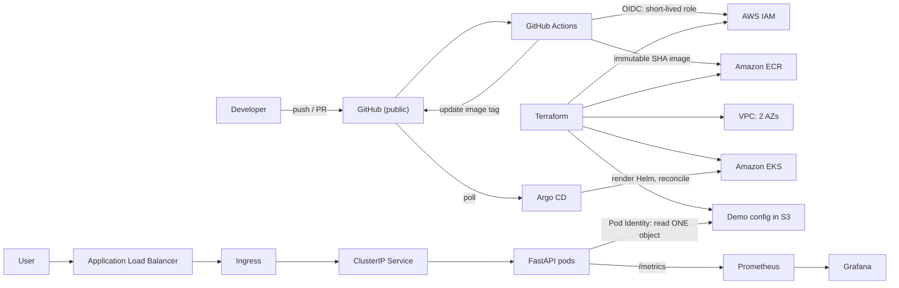

# eks-sre-demo

A small FastAPI service, operated like a production workload on Amazon EKS.

The application is deliberately trivial. Everything interesting is in how it gets
provisioned, secured, delivered, observed, and recovered — Terraform, GitHub OIDC,
ECR, Argo CD, ALB ingress, EKS Pod Identity, Prometheus, SLOs, burn-rate alerts,
and runbooks.

It is also, openly, a **learning project**. I am building it to get properly
comfortable with Kubernetes at the `kubectl apply` level rather than at the
"I ran a Helm chart once" level. [`docs/learning-log.md`](docs/learning-log.md)
records what surprised me and what I still don't know.

> [!NOTE]
> **Synthetic data only.** No PHI, no PII, no customer data, no employer
> configuration. This is a personal portfolio project and is not affiliated with,
> sponsored by, or endorsed by any company. It is not a production template —
> see [SECURITY.md](SECURITY.md) for the deliberate demo tradeoffs.

---

## Status

| Area | State |
|---|---|
| FastAPI app + tests | Complete — 20 tests passing |
| Container image | Complete — non-root, hash-pinned deps, read-only rootfs verified |
| Stage 1 manifests (`k8s/`) | Complete — renders and schema-validates |
| Stage 2 Helm chart (`charts/`) | Complete — lints and renders; equivalence to stage 1 verified |
| Terraform (`infra/`) | Applied and destroyed cleanly — 76 resources, zero orphans |
| CI workflow | Running and green — builds and smoke-tests the image on every PR |
| Argo CD | Ran on the live cluster: Synced/Healthy, drift behaviour documented |
| Evidence | 6 sanitized captures in [docs/evidence/](docs/evidence/) |
| Observability stack | Not installed - ServiceMonitor/PrometheusRule remain disabled |

The `publish` and `promote` jobs skip rather than fail until the AWS
infrastructure exists, because no cluster is running most of the time and a red
X on every commit would train everyone to ignore CI.

The cluster is **destroyed**. It ran 2026-08-13 to 2026-09-04 and cost **$199.94** -
substantially more than intended, because I left it up. That overrun is written
up honestly in [the learning log](docs/learning-log.md), and it is the most
useful thing in this repository: every guardrail I built *notified* rather than
*enforced*.

Everything the cluster demonstrated is captured in [docs/evidence/](docs/evidence/).

---

## Architecture



Two identity systems, solving different problems — this distinction is the point:

- **GitHub OIDC** authenticates the *CI runner* to AWS. No access keys exist.
- **EKS Pod Identity** authenticates the *pod* to AWS. It can read exactly one
  S3 object; anything else returns `AccessDenied`, on purpose.

---

## The delivery ladder

The same application is deployed three ways, and **all three stay in the repo**.
Deleting the simple one once the sophisticated one works would remove exactly the
evidence this project exists to provide.

| Stage | How | Where | What it shows |
|---|---|---|---|
| 1 | `kubectl apply -k` | [`k8s/`](k8s/) | The objects themselves. No tool generating them for me. |
| 2 | `helm upgrade --install` | [`charts/api/`](charts/api/) | Templating, values contract, release lifecycle. |
| 3 | `git commit` | [`gitops/`](gitops/) | Git as source of truth; drift repaired continuously. |

Every stage ends in the same place — HTTP requests to the Kubernetes API server,
and controllers reconciling toward what those requests recorded. Provable:

```bash
helm template demo-api charts/api -f gitops/environments/demo/values.yaml \
  | kubectl diff -f -
```

Stage 1 applies **once**. Stage 3 applies **forever**. That difference is the
whole argument for GitOps, and it is easier to make having done both.

[`docs/kubectl-apply-deep-dive.md`](docs/kubectl-apply-deep-dive.md) covers what
actually happens beneath `apply`: the `-v=8` HTTP exchange, client-side vs
server-side apply, `managedFields`, field-ownership conflicts, and why
`--dry-run=client` is not the offline check its name suggests.

---

## Read it in five minutes

Suggested order, with the thing worth noticing in each:

1. [`app/app/main.py`](app/app/main.py) — why the histogram has a `0.3` bucket
   (the latency SLO is 300 ms, and a histogram can only answer at a bucket edge).
2. [`k8s/base/deployment.yaml`](k8s/base/deployment.yaml) — `maxUnavailable: 0`,
   and why `spec.selector` is kept minimal.
3. [`charts/api/templates/deployment.yaml`](charts/api/templates/deployment.yaml) —
   `spec.replicas` is *omitted* when the HPA is on, so two controllers don't
   fight over one field.
4. [`infra/environments/demo/main.tf`](infra/environments/demo/main.tf) — the IAM
   policy allows one action on one object ARN.
5. [`.github/workflows/ci.yaml`](.github/workflows/ci.yaml) — `id-token: write`
   on one job only, guarded so a fork can never reach it.
6. [`docs/learning-log.md`](docs/learning-log.md) — what actually went wrong.

Full design document: [`docs/plan.md`](docs/plan.md).

---

## Cost, and why there is no local cluster

Everything runs on real EKS. There is no `kind` path, deliberately: the subject
here is operating *managed Kubernetes on AWS*, and a local emulation would prove
less while adding a second thing to maintain.

The cost of that choice is that cluster time is metered:

| | Approx. hourly | Approx. daily |
|---|---:|---:|
| Fully running | ~$0.34 | ~$8 |
| Node group scaled to 0 | ~$0.15 | ~$3.50 |
| `terraform destroy` | $0.00 | $0.00 |

Scaling to zero saves about 55%, not 100% — the control plane and the NAT
gateway bill regardless. Only teardown reaches zero. So the cluster is created
for a working session and destroyed at the end of it, and roughly half this
project ([which half](docs/plan.md#104-what-needs-a-cluster-and-what-does-not))
is built with no cluster running at all.

**Which means the repository has to stand on its own**, because that is the state
anyone opening this link will find it in. That is what
[`docs/evidence/`](docs/evidence/) is for: sanitized, committed captures of
everything that only exists while the cluster is alive.

```bash
make check     # everything that runs for free: lint, tests, render, tf validate
make tf-plan   # needs credentials, creates nothing, costs nothing
```

Running the full thing requires an AWS account and about 20 minutes to provision.
See [`docs/plan.md` §10](docs/plan.md) for the session model and
[§28.2](docs/plan.md) for the ordered teardown — Ingress before cluster, or you
orphan a load balancer that keeps billing.

---

## Versions

Nothing installs `latest`. Pinned set in
[`platform/versions.yaml`](platform/versions.yaml): kubectl 1.35.7, Helm 4.2.3,
Terraform 1.15.8, EKS 1.35, VPC module ~> 6.0, EKS module ~> 21.0.

## License

[MIT](LICENSE).
