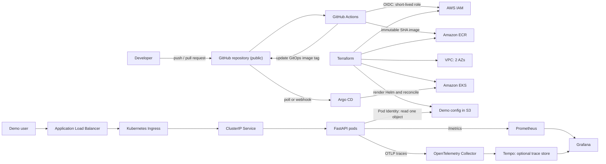
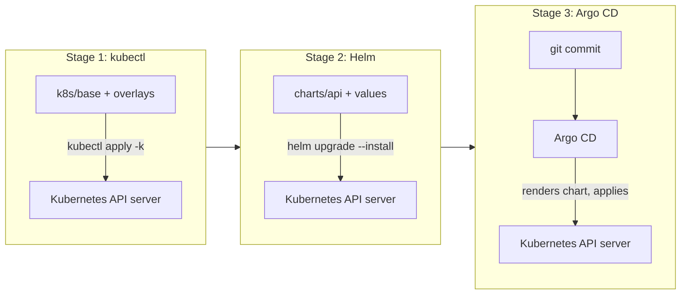

# Production-Lite API Platform on Kubernetes: SRE Portfolio Demo

> A developer-ready implementation plan for a **public, shareable** repository demonstrating AWS, Amazon EKS, Terraform, Helm, workload identity, ALB ingress, GitHub Actions, Argo CD, observability, SLOs, incident response — and, deliberately and visibly, plain `kubectl apply`.

**Repository:** `github.com/<GITHUB_OWNER>/eks-sre-demo` (public)
**Suggested region:** `<AWS_REGION>` (for example, `us-east-2`)
**Cluster name:** `sre-demo`
**Workload namespace:** `demo`
**Service account:** `demo-api`
**ECR repository:** `sre-demo-api`
**Primary Git branch:** `main`

> [!IMPORTANT]
> **NOTICE.** This is a personal learning and portfolio project. It uses synthetic data only. It contains no patient data, no PHI, no production credentials, no employer configuration, and no employer branding. It is not affiliated with, sponsored by, or endorsed by any company. Nothing here is a real healthcare system.

---

## 1. Executive summary

Build a small FastAPI service and operate it as a production-like workload on **Amazon EKS**. The repository is public so it can be shared as a single link and read end to end without access to any cloud account.

Terraform creates the AWS foundation. GitHub Actions tests the application, builds an immutable container image, and pushes it to ECR by assuming an AWS role through GitHub OIDC. Argo CD watches Git and deploys the Helm release. The AWS Load Balancer Controller exposes the API through an ALB. Prometheus, Grafana, and OpenTelemetry provide metrics and traces. SLOs, alerts, failure exercises, and runbooks demonstrate SRE judgment rather than only deployment mechanics.

**EKS is the only runtime.** There is no local-cluster path: every stage of the ladder below runs against the real cluster. That is a deliberate choice — the demo is about operating a managed Kubernetes service on AWS, and a local emulation would prove less. The cost of that choice is that cluster time is metered, so section 10 defines the operating discipline that keeps the bill small.

Three things make this version different from a generic EKS tutorial repo:

1. **The delivery path is a visible ladder, not a black box.** The same application is deployed three ways, all kept in the repository: raw manifests with `kubectl apply`, then Helm, then Argo CD. Each stage is documented as *the same API calls with progressively more automation*. Section 7 and section 22 carry this.
2. **It is honest about cost and lifecycle.** The cluster is created for a working session and destroyed at the end of it. Committed evidence in `docs/evidence/` means the repository still demonstrates everything after teardown, when a reader has no cluster to look at. Sections 10 and 24.3 carry this.
3. **It says out loud that it is a learning project.** A dated learning log records what was expected, what actually happened, and what is still unknown. Section 25 carries this.

### What the finished demo proves

- [ ] A public repository that explains itself without a live cluster
- [ ] Comfort at the raw Kubernetes API level: `kubectl apply`, server-side apply, field management, dry-run, diff
- [ ] Reproducible AWS infrastructure built with Terraform
- [ ] EKS managed nodes in private subnets across at least two Availability Zones
- [ ] Least-privilege pod access through EKS Pod Identity, with IRSA understood as an alternative
- [ ] Internet traffic through an AWS ALB to healthy Kubernetes pods
- [ ] An immutable CI path with no long-lived AWS keys in GitHub
- [ ] Git as the deployment source of truth through Argo CD
- [ ] Useful metrics, dashboards, traces, alerts, and SLO calculations
- [ ] Safe failure injection with evidence of detection, mitigation, and recovery
- [ ] Clear explanation of what happens beneath `kubectl apply`
- [ ] Repeatable runbooks and a concise interview presentation

---

## 2. Project goals and non-goals

### Goals

1. Show production-minded Kubernetes and AWS engineering without building an unnecessarily complex application.
2. Demonstrate the progression from manual to automated delivery honestly, keeping every rung of the ladder in the repository rather than deleting the simple version once the sophisticated one works.
3. Demonstrate separation of concerns:
   - Terraform owns AWS infrastructure and cluster prerequisites.
   - Raw manifests and Helm both express the application's Kubernetes resources; Helm is the one CI/CD uses.
   - GitHub Actions owns CI, image publication, and GitOps image promotion.
   - Argo CD owns continuous delivery and drift reconciliation.
4. Make reliability measurable with explicit SLIs, SLOs, alerts, and an error budget.
5. Demonstrate debugging at the application, Kubernetes, network, IAM, and AWS load-balancer layers.
6. Make the entire environment disposable, cost-aware, and reproducible by a stranger.

### Non-goals

- Building a real healthcare application or storing sensitive data
- Multi-account production landing-zone design
- A service mesh, multi-cluster failover, or a full data platform
- Proving every possible security control
- Running the environment continuously after the interview
- Pretending the author already knew all of this

---

## 3. Architecture



### Request path

```text
Client -> public ALB -> Ingress rule -> ClusterIP Service -> ready FastAPI pod
                                                    |
                                                    +-> /metrics scraped by Prometheus
                                                    +-> OTLP spans sent to OTel Collector
                                                    +-> S3 GetObject via EKS Pod Identity
```

### Deployment path

```text
Commit -> tests/lint/security checks -> build -> push ECR image tagged with commit SHA
       -> update GitOps values in Git -> Argo CD detects change -> Helm render/apply
       -> rolling update -> readiness succeeds -> ALB sends traffic to new pods
```

### Deliberate design choices

- **The `kubectl apply` stage is permanent, not scaffolding.** `k8s/` stays in the repository forever. It is the teaching surface and the honest starting point.
- **EKS is the only runtime; there is no local cluster.** The subject of the demo is operating managed Kubernetes on AWS, and a local emulation would prove less while adding a second thing to maintain. The cost of that choice is managed by the session discipline in section 10, not by pretending it is free.
- **Kustomize splits portable from AWS-specific.** `k8s/base/` holds objects that would run on any conformant cluster; `k8s/overlays/eks/` holds everything that makes it Amazon's. The boundary is the point.
- **EKS Pod Identity is the default workload identity.** It associates an IAM role with a namespace/service-account pair without an IAM OIDC provider per cluster. IRSA remains a documented comparison option.
- **GitHub OIDC is separate.** It authenticates the CI runner to AWS; it is not used by application pods.
- **Private worker nodes, public ALB.** A single NAT gateway reduces demo cost. In production, use a NAT gateway per Availability Zone or VPC endpoints based on availability and cost requirements.
- **Immutable image tags.** Deploy the Git commit SHA, never `latest`.
- **One repository.** Application, infrastructure, chart, and GitOps state live together for discoverability — which matters more than usual when the repository is also the presentation. Explain that larger organizations often split application and environment repositories.
- **No direct deployment from CI.** CI publishes an artifact and changes Git; Argo CD deploys from Git.

---

## 4. Public repository requirements

The repository is the artifact. The cluster is destroyed within hours; the link lasts. Everything in this section is a hard requirement before the first `git push`.

### 4.1 Identity and naming

- [ ] Repository name is neutral: `eks-sre-demo` (or `k8s-sre-demo`). **Do not put a prospective employer's name in the repository slug, cluster name, chart name, image name, or Terraform tags.** A public URL carrying someone else's brand reads as unsanctioned use of it. Name the role and the company in README prose if useful — that is context, not branding.
- [ ] All resource names are neutral: cluster `sre-demo`, image `sre-demo-api`, service account `demo-api`, Helm release `demo-api`.
- [ ] `LICENSE` at the repository root (MIT is fine) so the code is unambiguously shareable and reusable.
- [ ] `NOTICE` block at the top of the README: synthetic data only, no PHI, personal project, not affiliated with or endorsed by any employer.
- [ ] `SECURITY.md` stating that this is a demo, that it should not be used as a production template unchanged, and how to report a problem.

### 4.2 What must never be committed

`.gitignore` must contain at least:

```gitignore
# Terraform
.terraform/
*.tfstate
*.tfstate.*
*.tfvars
!*.tfvars.example
backend.hcl
crash.log

# Local environment
.env
kubeconfig*
*.local.yaml
.venv/

# Python
__pycache__/
.pytest_cache/
.ruff_cache/
```

Specific hazards for this project:

| Value | Why it matters in a public repo | Where the real value lives |
|---|---|---|
| `public_access_cidrs` | This is the author's **home IP address**. Committing it publishes where they live and what to aim at. | gitignored `terraform.tfvars` |
| AWS account ID | Not a secret, but it is an identifier for reconnaissance and it appears in ECR URLs and role ARNs. | gitignored `terraform.tfvars`, GitHub Actions variables, `values.local.yaml` |
| Terraform state bucket name | Reveals the state location. | gitignored `backend.hcl`, used via `terraform init -backend-config=backend.hcl` |
| S3 bucket names, cluster endpoint, ALB DNS | Live attack surface while the cluster is up. | Runtime only; never committed |
| Screenshots in `docs/evidence/` | Terminal captures leak account IDs and hostnames constantly. | Redact before committing |

Committed files use placeholders: `<AWS_ACCOUNT_ID>`, `<AWS_REGION>`, `<DEMO_BUCKET>`, `<ALB_DNS>`, `<YOUR_PUBLIC_IP>/32`.

Partial backend configuration keeps the state bucket out of Git:

```hcl
# infra/environments/demo/backend.tf  (committed)
terraform {
  backend "s3" {}
}
```

```hcl
# infra/environments/demo/backend.hcl  (gitignored)
bucket       = "<TF_STATE_BUCKET>"
key          = "eks-sre-demo/demo/terraform.tfstate"
region       = "<AWS_REGION>"
encrypt      = true
use_lockfile = true
```

```bash
terraform init -backend-config=backend.hcl
```

`use_lockfile = true` (S3-native state locking, no DynamoDB table) requires **Terraform >= 1.10**. Pin it:

```hcl
terraform {
  required_version = ">= 1.10.0"
}
```

### 4.3 GitHub repository settings

- [ ] **Secret scanning + push protection enabled.** Free on public repositories, and it will block a committed AWS key at push time rather than after the fact.
- [ ] **Actions → Fork pull request workflows → "Require approval for all external contributors."** Anyone can open a PR against a public repository; workflows must not run unreviewed.
- [ ] Branch protection on `main`: require the CI check, no force pushes.
- [ ] Dependabot enabled for `pip`, `docker`, and `github-actions`.
- [ ] A `gitleaks` or `trufflehog` job in CI as defense in depth.
- [ ] About description and topics set: `kubernetes`, `eks`, `terraform`, `helm`, `argocd`, `sre`, `gitops`, `observability`.
- [ ] Repository pinned on the GitHub profile.

### 4.4 CI hardening for public visibility

Public repositories accept pull requests from strangers. The publish path must be unreachable from a fork.

- Top-level `permissions: contents: read`.
- Grant `id-token: write` **only** on the job that needs it, and guard that job:

```yaml
if: >-
  github.repository == '<GITHUB_OWNER>/eks-sre-demo' &&
  github.event_name == 'push' &&
  github.ref == 'refs/heads/main'
```

- Split the GitOps image-tag commit into its own job so `contents: write` is not held by the build job.
- Never use `pull_request_target` in this repository.

**Explain this in the interview:** the OIDC trust policy's `sub` condition pins the exact repository and ref (`repo:<OWNER>/<REPO>:ref:refs/heads/main`). Making the repository public does not weaken it — visibility is not authorization. Only workflows running in that named repository on that ref can obtain a token AWS will accept. What public visibility does change is who can *propose* a workflow change, which is why branch protection and fork-approval settings carry the weight.

### 4.5 The repository must stand alone

Assume the reader has no AWS account, no cluster, and eight minutes. Since the cluster is destroyed after every session, **this is the normal case, not the edge case** — including for the interviewer, who will most likely open the link after the call rather than during it.

Because nothing here is runnable without an AWS account, the repository has to *show* rather than invite. That raises the bar on committed evidence considerably.

- [ ] README answers what this is, why it exists, and what to look at first — above the fold.
- [ ] `docs/evidence/` is the front-and-center proof: sanitized terminal captures and screenshots of everything that only exists while the cluster is alive. **This is the single most important section of the repository for a reader with no cluster.**
- [ ] The README states plainly that running it requires an AWS account and costs about $0.34/hr, with a link to section 10's cost model. No bait.
- [ ] Every internal link is relative so it resolves on github.com.
- [ ] No step depends on a console click that is not also written down.
- [ ] A reader who never runs anything can still follow one image from commit to ECR to Argo CD to a running pod, entirely through committed artifacts.

---

## 5. Prerequisites

### 5.1 Local tools

Installed and verified in the WSL2 (Ubuntu 26.04) working environment:

| Tool | Version | Notes |
|---|---|---|
| Docker CE | 29.7.2 | Installed in WSL, **not** Docker Desktop — no Windows service, nothing autostarts |
| kubectl | 1.35.7 | From `pkgs.k8s.io` v1.35 stream, `apt-mark hold` applied; bundles kustomize 5.7.1 |
| Helm | 4.2.3 | **Helm 4, not Helm 3** — see the compatibility note below |
| Terraform | 1.15.8 | Satisfies the `>= 1.10` floor needed for S3-native state locking |
| AWS CLI | 2.35.21 | Credentials not yet configured |
| gh | 2.96.0 | Authenticated |
| Python | 3.14.4 | Local tooling only; the container pins its own runtime |

Verify the baseline:

```bash
docker --version && kubectl version --client && helm version --short
terraform version && aws --version && python3 --version && git --version
aws sts get-caller-identity          # must succeed before section 13
```

Optional: `jq`, `trivy`, `k6` or `hey`, `gitleaks`, Argo CD CLI.

> [!NOTE]
> **Helm 4 compatibility.** The wider chart ecosystem and most published documentation still assume Helm 3, and Argo CD renders charts with its *own* embedded Helm binary rather than the local one. If a chart renders locally but Argo CD disagrees, install Helm 3 alongside as `helm3` and compare `helm template` output between the two before debugging anything else. Record whichever version the chart was validated against in `platform/versions.yaml`.

**Docker footprint.** Docker is installed with autostart disabled, so it consumes nothing until explicitly started:

```bash
sudo systemctl start docker     # before a working session
sudo systemctl stop docker      # after
```

A `%UserProfile%\.wslconfig` caps WSL at 8 GB RAM and 8 of 16 cores with `autoMemoryReclaim=gradual`, leaving the rest of the 31.6 GB host free. It takes effect after `wsl --shutdown`. Delete the file to revert.

> Commands in this document are bash, matching the WSL2 working environment and the public repository's Linux/macOS audience. PowerShell equivalents differ mainly in variable syntax (`$env:NAME`) and line continuation (backtick).

### 5.2 Accounts and access

- [ ] GitHub account with Actions enabled; repository created **public**
- [ ] Personal AWS account with permission to create VPC, EKS, EC2, ECR, IAM, ELB, S3, CloudWatch, and related resources
- [ ] AWS billing alarm and budget configured **before** provisioning
- [ ] GitHub Environment named `demo` for the deploy-adjacent workflows
- [ ] A source IP/CIDR to restrict public EKS API access: `<YOUR_PUBLIC_IP>/32` (kept out of Git)
- [ ] Optional DNS name and ACM certificate if demonstrating HTTPS

**AWS credentials are not yet configured.** `aws sts get-caller-identity` must succeed before section 13. Sections 11 and 12 (application and container) are the only work that can proceed without them — everything from section 13 onward requires a funded AWS account, and section 10 should be read before the first `terraform apply`.

### 5.3 Project variables

Keep real values in an untracked `.env` sourced locally:

```bash
export AWS_REGION="<AWS_REGION>"
export AWS_ACCOUNT_ID="$(aws sts get-caller-identity --query Account --output text)"
export CLUSTER_NAME="sre-demo"
export ECR_REPOSITORY="sre-demo-api"
export IMAGE_TAG="$(git rev-parse --short=12 HEAD)"
```

### 5.4 Version policy

Do not paste unpinned `latest` versions into infrastructure.

- [ ] Choose a currently supported EKS Kubernetes version in the target region.
- [ ] Pin Terraform and provider constraints in `versions.tf`; commit `.terraform.lock.hcl`.
- [ ] Pin Terraform module versions.
- [ ] Pin GitHub Actions to full commit SHAs; let Dependabot update them. On a public repository this is a visible supply-chain signal, not just hygiene.
- [ ] Pin Helm chart versions in a single `platform/versions.yaml`.
- [ ] Record the resolved EKS add-on versions after the first apply; they are chosen by AWS unless pinned.
- [ ] Record selected versions in the README.

---

## 6. Repository structure

```text
eks-sre-demo/
+-- README.md                        # Front door: pitch, diagram, evidence, guided tour
+-- LICENSE                          # MIT
+-- SECURITY.md
+-- Makefile                         # build, lint, apply-eks, helm-eks, evidence, destroy
+-- .gitignore
+-- .dockerignore
+-- .github/
|   +-- workflows/
|   |   +-- ci.yaml                  # Test, lint, scan, build, push
|   |   +-- promote.yaml             # Separate job: update GitOps image tag
|   |   +-- terraform-plan.yaml      # PR validation
|   |   +-- terraform-apply.yaml     # Protected/manual infrastructure apply
|   +-- dependabot.yml
+-- app/
|   +-- app/
|   |   +-- __init__.py
|   |   +-- main.py
|   |   +-- telemetry.py
|   |   +-- settings.py
|   +-- tests/
|   |   +-- test_health.py
|   |   +-- test_api.py
|   +-- pyproject.toml
|   +-- requirements.in
|   +-- requirements.lock            # pip-compile --generate-hashes
|   +-- Dockerfile
+-- k8s/                             # STAGE 1: plain manifests, applied with kubectl
|   +-- base/                        # Cloud-agnostic: the objects themselves
|   |   +-- namespace.yaml
|   |   +-- serviceaccount.yaml
|   |   +-- deployment.yaml
|   |   +-- service.yaml
|   |   +-- kustomization.yaml
|   +-- overlays/
|       +-- eks/                     # ALB ingress, ECR image, AWS env
|           +-- kustomization.yaml
|           +-- ingress.yaml
|           +-- patch-env.yaml
+-- charts/                          # STAGE 2: the same app, templated
|   +-- api/
|       +-- Chart.yaml
|       +-- values.yaml
|       +-- values.schema.json
|       +-- templates/
|           +-- _helpers.tpl
|           +-- deployment.yaml
|           +-- service.yaml
|           +-- serviceaccount.yaml
|           +-- ingress.yaml
|           +-- hpa.yaml
|           +-- pdb.yaml
|           +-- servicemonitor.yaml
|           +-- prometheusrule.yaml
|           +-- networkpolicy.yaml
+-- gitops/                          # STAGE 3: Git as source of truth
|   +-- applications/
|   |   +-- api-demo.yaml
|   +-- environments/
|       +-- demo/
|           +-- values.yaml          # CI changes image.tag here
+-- infra/
|   +-- bootstrap/                   # Optional S3 state bucket setup
|   +-- environments/
|       +-- demo/
|           +-- backend.tf           # Empty s3 block; real config in gitignored backend.hcl
|           +-- versions.tf
|           +-- providers.tf
|           +-- main.tf
|           +-- variables.tf
|           +-- outputs.tf
|           +-- terraform.tfvars.example
|           +-- policies/
|               +-- api-s3-read.json
|               +-- github-ecr-push.json
+-- platform/
|   +-- argocd/
|   +-- aws-load-balancer-controller/
|   +-- observability/
|   |   +-- kube-prometheus-stack-values.yaml
|   |   +-- otel-collector-values.yaml
|   |   +-- tempo-values.yaml
|   |   +-- dashboards/
|   +-- versions.yaml
+-- loadtest/
|   +-- smoke.js
+-- runbooks/
|   +-- high-5xx.md
|   +-- latency.md
|   +-- pod-not-ready.md
|   +-- alb-unhealthy.md
|   +-- gitops-out-of-sync.md
|   +-- telemetry-missing.md
|   +-- pod-identity-access-denied.md
+-- docs/
    +-- tour.md                      # Guided reading path for a reviewer
    +-- architecture.md              # Decisions and tradeoffs
    +-- kubectl-apply-deep-dive.md   # What actually happens beneath apply
    +-- learning-log.md              # What I expected / what happened / what I learned
    +-- slo.md
    +-- failure-exercises.md
    +-- demo-script.md
    +-- evidence/                    # Sanitized captures; the repo's proof after teardown
```

---

## 7. The delivery ladder: `kubectl apply` -> Helm -> Argo CD

This is the spine of the demonstration. The same application is deployed three ways. **All three stay in the repository.** Deleting the simple version once the sophisticated one works would remove exactly the evidence this project is meant to provide.



| Stage | Tool | Command | What it proves |
|---|---|---|---|
| 1 | Raw manifests | `kubectl apply -k k8s/overlays/eks` | I can read and write Kubernetes objects and drive the API server directly. I know what a Deployment, Service, ServiceAccount, and Ingress actually contain. |
| 2 | Helm | `helm upgrade --install demo-api charts/api -f ...` | Templating, a values contract, release lifecycle, and rollback. |
| 3 | Argo CD | `git commit && git push` | Git as source of truth, continuous reconciliation, drift repair, auditable rollback. |

All three run against the **same EKS cluster**. Progressing through them on one cluster is itself instructive: stage 2 must adopt the objects stage 1 created, and stage 3 must adopt stage 2's release. Those handoffs are where field ownership becomes real rather than theoretical — see section 22.3.

### 7.1 The framing that ties them together

Every stage ends in the same place: HTTP requests to the Kubernetes API server, and controllers reconciling toward the state those requests recorded. Helm is a template engine plus a release ledger. Argo CD is a controller that renders the same templates and applies them on your behalf, forever, instead of once.

Demonstrate the equivalence directly:

```bash
# Helm's output is just manifests. Prove it, and validate them server-side
# without changing anything:
helm template demo-api charts/api -f gitops/environments/demo/values.yaml \
  | kubectl apply --dry-run=server -f -

# And see exactly what would change against the live cluster:
helm template demo-api charts/api -f gitops/environments/demo/values.yaml \
  | kubectl diff -f -
```

### 7.2 Base manifests

`k8s/base/` contains no templating and no cloud-specific fields. Keeping the AWS specifics in an overlay rather than inlining them is deliberate: it makes the boundary between "this is Kubernetes" and "this is Amazon's implementation of it" explicit, which is exactly the distinction worth being able to draw in an interview. Sketch of `k8s/base/deployment.yaml`:

```yaml
apiVersion: apps/v1
kind: Deployment
metadata:
  name: demo-api
  labels:
    app.kubernetes.io/name: demo-api
spec:
  replicas: 2
  selector:
    matchLabels:
      app.kubernetes.io/name: demo-api
  strategy:
    type: RollingUpdate
    rollingUpdate:
      maxUnavailable: 0
      maxSurge: 1
  template:
    metadata:
      labels:
        app.kubernetes.io/name: demo-api
    spec:
      serviceAccountName: demo-api
      terminationGracePeriodSeconds: 30
      securityContext:
        runAsNonRoot: true
        seccompProfile:
          type: RuntimeDefault
      containers:
        - name: api
          image: sre-demo-api:local   # overlays replace this
          ports:
            - name: http
              containerPort: 8080
          securityContext:
            allowPrivilegeEscalation: false
            readOnlyRootFilesystem: true
            runAsUser: 10001
            runAsGroup: 10001
            capabilities:
              drop: ["ALL"]
          resources:
            requests: { cpu: 100m, memory: 128Mi }
            limits:   { cpu: 500m, memory: 256Mi }
          startupProbe:
            httpGet: { path: /health/live, port: http }
            failureThreshold: 30
            periodSeconds: 2
          livenessProbe:
            httpGet: { path: /health/live, port: http }
            periodSeconds: 10
          readinessProbe:
            httpGet: { path: /health/ready, port: http }
            periodSeconds: 5
          volumeMounts:
            - name: tmp
              mountPath: /tmp
      volumes:
        - name: tmp
          emptyDir: {}
```

`k8s/base/kustomization.yaml`:

```yaml
apiVersion: kustomize.config.k8s.io/v1beta1
kind: Kustomization
namespace: demo
resources:
  - namespace.yaml
  - serviceaccount.yaml
  - deployment.yaml
  - service.yaml
commonLabels:
  app.kubernetes.io/name: demo-api
  app.kubernetes.io/part-of: eks-sre-demo
```

The `eks` overlay adds the ALB-annotated Ingress, pins the ECR image, and sets the AWS environment. Everything in `k8s/base/` would run on any conformant cluster; everything in the overlay is what makes it an *AWS* deployment.

### 7.3 Stage exit criteria

- **Stage 1 done:** `kubectl apply -k k8s/overlays/eks` produces two ready pods, a Service with populated EndpointSlices, and a `/health/ready` reachable through port-forward (before the ALB exists) and then through the ALB. The author can explain every field in the manifests without reading the docs.
- **Stage 2 done:** `helm upgrade --install` produces an equivalent result, and `helm template | kubectl diff -f -` shows no unexplained difference from stage 1.
- **Stage 3 done:** a Git commit changes the running image, and a manual `kubectl scale` is reverted by Argo CD within its sync interval.

### 7.4 Handing objects between stages

Because all three stages target one cluster, each promotion is an ownership transfer, and each has a documented failure mode worth experiencing on purpose:

| Transition | What can go wrong | Handling |
|---|---|---|
| kubectl -> Helm | Helm refuses to adopt objects it did not create: *"invalid ownership metadata"* | Either delete the stage-1 objects first, or add the `app.kubernetes.io/managed-by: Helm` label and `meta.helm.sh/release-name` + `release-namespace` annotations so Helm adopts them |
| Helm -> Argo CD | Argo reports `OutOfSync` on fields Helm set, or fights over server-side apply field ownership | Let Argo own the release; `ServerSideApply=true` in the Application makes ownership explicit rather than implicit |
| Any -> HPA | Two controllers write `spec.replicas` | Omit `replicas` under autoscaling (section 14.3) |

Do each transition deliberately, capture the error before fixing it, and write it up in the learning log. "I hit Helm's ownership check and here is exactly what it said" is a better answer than never having seen it.

---

## 8. MVP-first sequence: begin here

The strongest first milestone is a complete thin vertical slice. Get the application and container fully working **before** creating any AWS resources — that part costs nothing and is where most of the debugging happens anyway. Then create the cluster once and work through the ladder on it in a single session rather than provisioning and destroying repeatedly.

### First 90 minutes (no AWS spend)

- [ ] Create the public repository with the structure in section 6, plus README, LICENSE, and `.gitignore`.
- [ ] Implement `/`, `/health/live`, `/health/ready`, `/metrics`, `/api/v1/work`, `/api/v1/config`.
- [ ] Add tests and run the application locally.
- [ ] Build and run the container as a non-root user; verify it under plain `docker run`.
- [ ] Write `k8s/base` and `k8s/overlays/eks`; validate offline with `kubectl kustomize`.
- [ ] Commit the architecture diagram, goals, and the first learning-log entry.

```bash
sudo systemctl start docker

git init && git checkout -b main
python3 -m venv .venv && source .venv/bin/activate
python -m pip install --upgrade pip pip-tools
python -m pip install fastapi "uvicorn[standard]" prometheus-client pytest httpx
pytest -q

docker build -t sre-demo-api:local ./app
docker run --rm -d --name api -p 8080:8080 sre-demo-api:local
curl -fsS http://localhost:8080/health/ready
curl -fsS http://localhost:8080/api/v1/config    # "disabled" - proves it runs with no AWS
curl -fsS http://localhost:8080/metrics | head
docker rm -f api

# Manifests must be structurally valid before a cluster exists to reject them.
kubectl kustomize k8s/overlays/eks | head -40
```

Note what this does and does not check. `kubectl kustomize` renders and parses the YAML, so it catches syntax errors, bad references, and kustomize mistakes. It does **not** validate against the Kubernetes schema.

And `kubectl apply --dry-run=client` is *not* the offline alternative it sounds like: since kubectl 1.24-ish it downloads the OpenAPI schema from the API server to validate, so with no cluster it fails with `dial tcp 127.0.0.1:8080: connect: connection refused`. Passing `--validate=false` makes it run, but then it validates almost nothing. For real offline schema validation use `kubeconform` against the target Kubernetes version. This surprise is section 22.5, and hitting it this early is a good first learning-log entry.

### MVP build order

1. **Local application and tests** — prove behavior before adding infrastructure. *(free)*
2. **Docker image** — prove a reproducible, non-root runtime. *(free)*
3. **Manifests written and client-validated** — `k8s/base` + `k8s/overlays/eks`. *(free, section 7)*
4. **Terraform VPC + EKS + ECR** — the first thing that costs money. *(section 13)*
5. **ECR push + `kubectl apply -k k8s/overlays/eks`** — stage 1 of the ladder, on the real cluster.
6. **Apply mechanics captured** — `-v=8` trace, `managedFields`, server-side apply conflict. *(section 22)*
7. **Helm chart** — stage 2; adopt or replace the stage-1 objects. *(section 14)*
8. **Pod Identity + one S3 read** — least-privilege AWS access. *(section 15)*
9. **AWS Load Balancer Controller + Ingress** — expose the API through an ALB. *(section 16)*
10. **GitHub Actions OIDC** — automate test, build, scan, push. *(section 17)*
11. **Argo CD** — stage 3; move deployment ownership from the workstation to Git. *(section 18)*
12. **Prometheus/Grafana + SLO dashboard** — make reliability visible. *(section 19, 20)*
13. **OpenTelemetry + Tempo** — add a trace through the service.
14. **Failure exercises + runbooks** — demonstrate operational response. *(section 21, 23)*
15. **Capture evidence, rehearse, destroy the cluster.** *(section 26, 28)*

Steps 1 through 3 cost nothing. From step 4 the meter is running — read section 10 first.

### MVP definition of done

- One commit produces one ECR image tagged with its SHA.
- Argo CD reports `Healthy` and `Synced` for the same SHA.
- The ALB returns `200` from `/health/ready` and the main API route.
- Grafana shows request rate, error rate, and latency.
- A pod deletion recovers without user-visible failure under load.
- The pod can read exactly one S3 object with Pod Identity and receives `AccessDenied` outside the allowed scope.
- `terraform destroy` removes the paid AWS resources, and the repository still demonstrates everything except the live AWS pieces.

---

## 9. Phased implementation plan

| Phase | Deliverable | Exit criterion |
|---|---|---|
| 0 | Public repo guardrails | Repo public with LICENSE, NOTICE, `.gitignore`, secret scanning, fork-approval; budget exists; versions recorded |
| 1 | FastAPI application | Local tests pass; health, metrics, work, and config endpoints behave — including config degrading with no bucket configured |
| 2 | Container | Image runs as non-root, hash-locked deps, passes a local smoke test under plain `docker run` |
| 3 | **Manifests authored** | **`k8s/base` + `k8s/overlays/eks` render with `kubectl kustomize` and pass `kubeconform`; no cluster needed, no spend** |
| 4 | Terraform foundation | VPC, EKS, nodes, ECR, IAM, S3 exist; `kubectl` connects; **cost clock starts** |
| 5 | **Stage 1: `kubectl apply`** | **`kubectl apply -k k8s/overlays/eks` yields two ready pods and populated EndpointSlices on EKS** |
| 6 | **Apply mechanics understood** | **`docs/kubectl-apply-deep-dive.md` written from captured output: `-v=8` trace, managedFields, a real SSA conflict, dry-run, diff** |
| 7 | Stage 2: Helm | Chart renders equivalently to stage 1; ownership handoff performed and documented (section 7.4) |
| 8 | AWS workload identity | App reads the allowed S3 object without static credentials; denial proven |
| 9 | ALB ingress | Public ALB has healthy targets and routes to the service |
| 10 | CI | GitHub OIDC publishes a tested, scanned, immutable image; fork PRs cannot reach it |
| 11 | GitOps | Argo CD reconciles the Helm release from Git and repairs drift |
| 12 | Observability and SLOs | RED dashboard, traces, SLOs, and burn alerts work |
| 13 | Reliability exercises | Each injected failure is detected, diagnosed, recovered, documented |
| 14 | Shareable artifact | README, tour, evidence, and learning log complete; repo readable with no cluster |
| 15 | Interview readiness | Demo fits 10-12 minutes and has offline evidence |

---

## 10. Cost-aware EKS operating discipline

With no local cluster, every hour of Kubernetes practice is billed. That is an acceptable trade — the demo is about operating EKS, and EKS is what gets operated — but it has to be managed deliberately rather than discovered on a statement. This section is the operating model.

Read it before the first `terraform apply`.

### 10.1 What the cluster actually costs

Approximate on-demand `us-east-2` rates. **Verify against current AWS pricing pages before provisioning** — prices vary by region and change over time.

| Component | Approx. hourly | Notes |
|---|---:|---|
| EKS control plane | $0.10 | Per cluster, billed whether or not any node exists |
| 2 x `t3.large` on-demand | $0.166 | The workload nodes |
| NAT gateway | $0.045 + data | **Billed hourly even at zero traffic**, plus ~$0.045/GB processed |
| ALB | $0.023 + LCU | Only exists once the Ingress is created |
| EBS gp3 (2 x 20 GB) | ~$0.004 | Node root volumes |
| **Total, running** | **~$0.34/hr** | Roughly **$8/day** if left up, ~$245/month |

The two numbers worth internalizing:

- **A working session is cheap.** Four hours of focused work is about **$1.40**. That is not the risk.
- **Forgetting is expensive.** A cluster left running over a long weekend is about **$25**, and a month is about **$245**.

### 10.2 Scaling down does not get you to zero

The intuitive money-saver — scale the node group to zero overnight — is only a partial fix, because the control plane and NAT gateway bill regardless:

| State | Approx. hourly | Approx. daily |
|---|---:|---:|
| Fully running | $0.34 | $8.16 |
| Node group scaled to 0 | $0.145 | $3.48 |
| `terraform destroy` | $0.00 | $0.00 |

Scaling to zero saves roughly 55%. **Only teardown saves 100%**, and the NAT gateway is the component people forget — it accrues silently with no traffic and no instances.

```bash
# Partial: keeps cluster/VPC/NAT, drops the EC2 charge. Fine for a lunch break.
aws eks update-nodegroup-config --cluster-name "$CLUSTER_NAME" \
  --nodegroup-name <NODEGROUP> --scaling-config minSize=0,maxSize=3,desiredSize=0 \
  --region "$AWS_REGION"

# Restore
aws eks update-nodegroup-config --cluster-name "$CLUSTER_NAME" \
  --nodegroup-name <NODEGROUP> --scaling-config minSize=1,maxSize=3,desiredSize=2 \
  --region "$AWS_REGION"
```

Scaling back up takes a few minutes and pods will be Pending until nodes register — worth doing once deliberately so the behavior is familiar rather than alarming during a demo.

### 10.3 The session model

Treat the cluster as ephemeral and the repository as permanent.

1. **Plan the session before creating anything.** Know which build-order steps you intend to finish. `terraform apply` is not a browsing activity.
2. **Create.** `terraform apply` takes roughly 15-20 minutes for VPC + EKS + node group; budget for it.
3. **Work through consecutive build-order steps** in one sitting rather than spreading one step per day across a week of cluster uptime.
4. **Capture evidence as you go** (section 24.3), not at the end. Evidence is the thing that survives teardown; anything not captured has to be recreated at $0.34/hr.
5. **Destroy at the end of the session** following the ordered teardown in section 28.2. Ingress and ALB first, cluster last.
6. **Verify teardown actually completed.** Orphaned NAT gateways, ALBs, and Elastic IPs keep billing after a partial destroy.

Rehearse the full create-work-destroy cycle at least once well before the interview, so that neither the 20-minute provisioning wait nor a teardown failure is a surprise on the day.

### 10.4 What needs a cluster, and what does not

Do the second column for free, before and between sessions. Roughly half the project never needs a running cluster.

| Needs a live EKS cluster | Can be done with no cluster (free) |
|---|---|
| `kubectl apply` and the whole ladder | Writing manifests; `kubectl kustomize` render + `kubeconform` schema check |
| Server-side apply, `managedFields`, conflicts | `helm lint`, `helm template`, chart authoring |
| Pod Identity and the S3 read/deny proof | Application code, unit tests, container build and `docker run` |
| ALB provisioning and target health | Terraform authoring, `fmt`, `validate`, and `plan` |
| Prometheus, Grafana, traces, burn alerts | PromQL written against recorded output; dashboard JSON |
| Failure exercises and recovery timing | Runbook drafting; README, tour, architecture, learning log |
| Argo CD sync and drift repair | CI workflow authoring; Argo `Application` manifest authoring |

`terraform plan` requires credentials but creates nothing and costs nothing — use it freely to check infrastructure changes without applying them.

### 10.5 Guardrails to set up first

- [ ] **AWS Budget with an email alert** at a threshold you would actually notice (for example $20/month), created *before* the first apply.
- [ ] A billing alarm as a second, independent signal.
- [ ] `DeleteAfter = <YYYY-MM-DD>` tag on everything, via Terraform `default_tags`.
- [ ] A calendar reminder for the same date — tags do not delete anything by themselves.
- [ ] The teardown checklist in section 28.2 rehearsed once, with the orphan checks run afterward.
- [ ] Cost Explorer checked the day after the first session, to confirm the bill matches the model above.

The strongest cost control in this project is reproducible teardown, not optimistic memory — and that is worth saying in the interview, because it is an SRE answer rather than a hobbyist one.

---

## 11. FastAPI application

### 11.1 Required behavior

| Route | Purpose | Expected behavior |
|---|---|---|
| `GET /` | Demo response | Returns service name, version/SHA, and request ID |
| `GET /health/live` | Liveness | 200 if the process can serve requests |
| `GET /health/ready` | Readiness | 200 only when the app can accept traffic |
| `GET /metrics` | Prometheus scrape | Counters and a latency histogram |
| `GET /api/v1/config` | Pod Identity proof | Reads only `s3://<BUCKET>/config/demo.json`; **returns a clear "disabled" response when no bucket is configured** |
| `GET /api/v1/work` | Failure exercise | Applies controlled latency/error settings from environment variables |

Keep liveness independent of S3 or any remote system. A transient dependency failure must not cause kubelet to restart a healthy process. Readiness may include only dependencies that genuinely make the pod unable to serve.

**`/api/v1/config` must degrade, not crash.** When `DEMO_BUCKET` is unset it returns `200` with `{"source": "disabled", "reason": "no bucket configured"}` rather than raising a `KeyError`. This is what lets the container be built, run, and smoke-tested under plain `docker run` with no AWS credentials — which is most of the development loop, and all of phases 1 through 3. It also means a failed S3 read degrades one endpoint instead of taking down the container.

### 11.2 Configuration

```text
SERVICE_NAME=sre-demo-api
APP_VERSION=<GIT_SHA>
AWS_REGION=<AWS_REGION>          # unset locally
DEMO_BUCKET=<S3_BUCKET>          # unset locally -> config endpoint reports "disabled"
DEMO_OBJECT_KEY=config/demo.json
FAILURE_RATE=0.0
LATENCY_MS=0
OTEL_SERVICE_NAME=sre-demo-api
OTEL_EXPORTER_OTLP_ENDPOINT=http://otel-collector.monitoring.svc.cluster.local:4317
```

### 11.3 Application skeleton

```python
import asyncio
import os
import random
import time
import uuid

from fastapi import FastAPI, HTTPException, Request, Response
from prometheus_client import CONTENT_TYPE_LATEST, Counter, Histogram, generate_latest

app = FastAPI(title="sre-demo-api")

REQUESTS = Counter(
    "http_requests_total",
    "HTTP requests",
    ["method", "route", "status"],
)
LATENCY = Histogram(
    "http_request_duration_seconds",
    "HTTP request latency",
    ["method", "route"],
    # 0.3 is present deliberately: the latency SLO is 300 ms, and a
    # histogram cannot answer a threshold question without that bucket edge.
    buckets=(0.01, 0.025, 0.05, 0.1, 0.25, 0.3, 0.5, 1, 2.5, 5),
)


@app.middleware("http")
async def observe(request: Request, call_next):
    request_id = request.headers.get("x-request-id", str(uuid.uuid4()))
    start = time.perf_counter()
    status = 500
    try:
        response = await call_next(request)
        status = response.status_code
        response.headers["x-request-id"] = request_id
        return response
    finally:
        route = request.scope.get("route")
        # Use the route template, never the raw path: raw paths are unbounded
        # cardinality and will eventually hurt Prometheus.
        route_template = getattr(route, "path", "unmatched")
        REQUESTS.labels(request.method, route_template, str(status)).inc()
        LATENCY.labels(request.method, route_template).observe(time.perf_counter() - start)


@app.get("/health/live")
def live():
    return {"status": "live"}


@app.get("/health/ready")
def ready():
    return {"status": "ready"}


@app.get("/metrics", include_in_schema=False)
def metrics():
    return Response(generate_latest(), media_type=CONTENT_TYPE_LATEST)


@app.get("/api/v1/work")
async def work():
    await asyncio.sleep(int(os.getenv("LATENCY_MS", "0")) / 1000)
    if random.random() < float(os.getenv("FAILURE_RATE", "0")):
        raise HTTPException(status_code=503, detail="injected failure")
    return {"status": "ok", "version": os.getenv("APP_VERSION", "dev")}


@app.get("/api/v1/config")
def config():
    bucket = os.getenv("DEMO_BUCKET")
    if not bucket:
        # No AWS configured (local `docker run`). Degrade clearly instead of crashing.
        return {"source": "disabled", "reason": "no bucket configured"}

    import boto3  # imported lazily so the local path needs no AWS SDK call path

    # The default credential chain receives short-lived Pod Identity credentials.
    client = boto3.client("s3", region_name=os.environ["AWS_REGION"])
    result = client.get_object(
        Bucket=bucket,
        Key=os.getenv("DEMO_OBJECT_KEY", "config/demo.json"),
    )
    return {"source": "s3", "config": result["Body"].read().decode("utf-8")}
```

Improvements before the interview:

- [ ] Add OpenTelemetry FastAPI and botocore instrumentation.
- [ ] Emit structured JSON logs with request ID, trace ID, route, status, version, duration.
- [ ] Never label metrics with raw URLs, request IDs, user IDs, or exception messages.
- [ ] Validate `FAILURE_RATE` and `LATENCY_MS` at startup.
- [ ] Keep failure injection off by default and label it demo-only.
- [ ] Mock AWS in unit tests; use the real bucket only in an integration smoke test.
- [ ] Add graceful shutdown and sufficient termination time.

### 11.4 Tests

- Unit tests for liveness, readiness, main response, injected failure
- Metrics test verifying the counter and histogram exist, and that the `0.3` bucket is present
- Config test for both branches: mocked S3, and the "disabled" path with `DEMO_BUCKET` unset
- Container smoke test using `/health/ready`
- Manifest and chart render tests: security context, probes, resources, image tag, service account

```bash
pytest -q
ruff check ./app && ruff format --check ./app
docker build -t sre-demo-api:test ./app
docker run -d --name api-test -p 8080:8080 sre-demo-api:test
curl -fsS --retry 10 --retry-delay 1 http://localhost:8080/health/ready
docker rm -f api-test

# Manifests and chart must both be valid before anything reaches a cluster
kubectl kustomize k8s/overlays/eks > /dev/null
helm lint charts/api
helm template demo-api charts/api -f gitops/environments/demo/values.yaml > /dev/null
```

---

## 12. Docker and Amazon ECR

### 12.1 Container requirements

- Multi-stage build or a minimal build context
- **Hash-pinned lock file** (see below)
- Non-root UID/GID
- Read-only root filesystem, with an `emptyDir` at `/tmp`
- No shell, compiler, credentials, tests, or cache in the runtime image unless required
- OCI labels for source repository and revision
- `PYTHONDONTWRITEBYTECODE=1`, unbuffered logs
- Exec-form command so termination signals reach the server
- Image vulnerability scan in CI

Generate the lock file with hashes so `--require-hashes` is honest rather than aspirational:

```bash
pip-compile --generate-hashes --output-file app/requirements.lock app/requirements.in
```

`app/Dockerfile`:

```dockerfile
FROM python:3.12-slim AS runtime

ARG GIT_SHA=dev
LABEL org.opencontainers.image.revision=$GIT_SHA \
      org.opencontainers.image.source=https://github.com/<GITHUB_OWNER>/eks-sre-demo

ENV PYTHONDONTWRITEBYTECODE=1 \
    PYTHONUNBUFFERED=1 \
    PIP_NO_CACHE_DIR=1 \
    APP_VERSION=$GIT_SHA

RUN groupadd --gid 10001 app && useradd --uid 10001 --gid app --no-create-home app
WORKDIR /app
COPY requirements.lock ./requirements.lock
RUN python -m pip install --no-cache-dir --require-hashes -r requirements.lock
COPY app ./app
USER 10001:10001
EXPOSE 8080
CMD ["python", "-m", "uvicorn", "app.main:app", "--host", "0.0.0.0", "--port", "8080", "--proxy-headers"]
```

### 12.2 Manual ECR push for the first EKS slice

```bash
export ECR_URI="${AWS_ACCOUNT_ID}.dkr.ecr.${AWS_REGION}.amazonaws.com/${ECR_REPOSITORY}"
aws ecr get-login-password --region "$AWS_REGION" \
  | docker login --username AWS --password-stdin "${AWS_ACCOUNT_ID}.dkr.ecr.${AWS_REGION}.amazonaws.com"

docker build --build-arg GIT_SHA="$IMAGE_TAG" -t "${ECR_URI}:${IMAGE_TAG}" ./app
docker push "${ECR_URI}:${IMAGE_TAG}"
aws ecr describe-images --region "$AWS_REGION" --repository-name "$ECR_REPOSITORY"
```

ECR checklist:

- [ ] Tag mutability is `IMMUTABLE`.
- [ ] Scanning is intentionally configured.
- [ ] Lifecycle policy retains a few tagged images, expires untagged ones.
- [ ] Repository is not public.
- [ ] CI can push only to this repository.
- [ ] Application pods have no ECR push permission; nodes only pull.

---

## 13. Terraform and EKS setup

### 13.1 State strategy

For the fastest start, use local state for the disposable demo. Before calling it team-ready, bootstrap a versioned, encrypted S3 state bucket and migrate. Never commit state files — and on a public repository, never commit the bucket name either (section 4.2).

### 13.2 Terraform resource scope

- VPC with DNS support/hostnames enabled
- Public subnets in two AZs for the ALB
- Private subnets in two AZs for worker nodes
- Internet gateway, route tables, one NAT gateway for the demo
- EKS control plane with control-plane logs enabled
- EKS managed node group, two nodes initially
- EKS add-ons: VPC CNI, CoreDNS, kube-proxy, EKS Pod Identity Agent
- ECR repository with scan-on-push, immutable tags, lifecycle policy
- S3 bucket plus one synthetic `config/demo.json` object
- IAM role/policy for the application's Pod Identity
- EKS Pod Identity association for `demo/demo-api`
- IAM OIDC provider and tightly scoped GitHub Actions role
- IAM role for AWS Load Balancer Controller (Pod Identity preferred)
- Optional EBS CSI driver and role if persistent Prometheus/Tempo volumes are enabled
- Cost tags on all supported resources

```hcl
default_tags {
  tags = {
    Project     = "eks-sre-demo"
    Environment = "demo"
    ManagedBy   = "terraform"
    Owner       = "<YOUR_NAME>"
    DeleteAfter = "<YYYY-MM-DD>"
  }
}
```

### 13.3 Baseline variables

```hcl
variable "aws_region" {
  type = string
}

variable "cluster_name" {
  type    = string
  default = "sre-demo"
}

variable "kubernetes_version" {
  type        = string
  description = "A currently supported EKS Kubernetes version verified in the target region."
}

variable "public_access_cidrs" {
  type        = list(string)
  description = "Restrict to the operator's public IP. Never commit the real value; never leave 0.0.0.0/0."
}

variable "github_repository" {
  type        = string
  description = "owner/repository"
}
```

`terraform.tfvars.example` (committed; the real `terraform.tfvars` is gitignored):

```hcl
aws_region          = "<AWS_REGION>"
cluster_name        = "sre-demo"
kubernetes_version  = "<SUPPORTED_EKS_VERSION>"
public_access_cidrs = ["<YOUR_PUBLIC_IP>/32"]
github_repository   = "<GITHUB_OWNER>/eks-sre-demo"
```

### 13.4 VPC and subnet requirements

- Two Availability Zones.
- Nodes in private subnets; internet-facing ALB in public subnets.
- Explicit discovery tags:

```text
Public subnet:  kubernetes.io/role/elb = 1
Private subnet: kubernetes.io/role/internal-elb = 1
Both:           kubernetes.io/cluster/sre-demo = shared
```

- One NAT gateway only as a declared demo cost tradeoff.
- Production discussion point: one NAT gateway per AZ avoids a cross-AZ dependency; ECR/S3/STS/CloudWatch VPC endpoints reduce NAT traffic and tighten egress.
- Check pod IP capacity before choosing subnet sizes; the VPC CNI assigns VPC addresses to pods.

### 13.5 EKS configuration

```text
Endpoint: public + private; public access restricted to <YOUR_PUBLIC_IP>/32
Control-plane logs: api, audit, authenticator, controllerManager, scheduler
Managed node group: desired=2, min=1, max=3
Instance type: t3.large (adjust after observing requests and scheduling)
Capacity: on-demand for predictable interview behavior
Root volume: encrypted gp3
Nodes: private subnets in two AZs
Access: EKS access entries, not manual edits to aws-auth
```

Checklist:

- [ ] Pin the EKS version; do not accept an accidental upgrade.
- [ ] Enable control-plane logs.
- [ ] Restrict the API endpoint CIDR.
- [ ] Use an EKS access entry for the operator role.
- [ ] Keep application IAM permissions off the node role.
- [ ] Require IMDSv2 and restrict pod access to node metadata where practical.
- [ ] Enable VPC CNI network policy support before claiming NetworkPolicies are enforced.
- [ ] Use managed add-ons and record resolved versions.
- [ ] Encrypt node volumes.
- [ ] Configure node and pod labels useful for cost and topology analysis.

### 13.6 Terraform workflow

```bash
cd infra/environments/demo
cp terraform.tfvars.example terraform.tfvars   # then edit with real values (gitignored)
terraform fmt -recursive
terraform init -backend-config=backend.hcl     # or plain `terraform init` for local state
terraform validate
terraform plan -out tfplan
terraform show tfplan
terraform apply tfplan

aws eks update-kubeconfig --region "$AWS_REGION" --name "$CLUSTER_NAME"
kubectl cluster-info
kubectl get nodes -o wide
kubectl get pods -A
```

### 13.7 Useful outputs

```hcl
output "cluster_name"       { value = module.eks.cluster_name }
output "cluster_endpoint"   { value = module.eks.cluster_endpoint }
output "ecr_repository_url" { value = aws_ecr_repository.api.repository_url }
output "demo_bucket_name"   { value = aws_s3_bucket.demo.id }
output "github_role_arn"    { value = aws_iam_role.github_actions.arn }
output "api_pod_role_arn"   { value = aws_iam_role.api_pod.arn }
```

Outputs print real identifiers. Redact them in any committed screenshot.

---

## 14. Helm chart

### 14.1 Chart responsibilities

Deployment, ClusterIP Service, ServiceAccount `demo-api`, optional ALB Ingress, three probe types, requests/limits, pod and container security contexts, rolling update strategy, topology spread or anti-affinity, PodDisruptionBudget, HorizontalPodAutoscaler, ServiceMonitor, PrometheusRule, and a NetworkPolicy only when enforcement is actually enabled.

### 14.2 Values contract

```yaml
replicaCount: 2

image:
  repository: <AWS_ACCOUNT_ID>.dkr.ecr.<AWS_REGION>.amazonaws.com/sre-demo-api
  tag: <GIT_SHA>
  pullPolicy: IfNotPresent

serviceAccount:
  create: true
  name: demo-api

service:
  port: 80
  targetPort: 8080

ingress:
  enabled: true
  className: alb
  scheme: internet-facing
  targetType: ip

resources:
  requests: { cpu: 100m, memory: 128Mi }
  limits:   { cpu: 500m, memory: 256Mi }

probes:
  startup:   { path: /health/live,  failureThreshold: 30, periodSeconds: 2 }
  liveness:  { path: /health/live,  periodSeconds: 10 }
  readiness: { path: /health/ready, periodSeconds: 5 }

autoscaling:
  enabled: true
  minReplicas: 2
  maxReplicas: 5
  targetCPUUtilizationPercentage: 70

pdb:
  enabled: true
  minAvailable: 1

observability:
  serviceMonitor: { enabled: true }
  prometheusRule: { enabled: true }

env:
  AWS_REGION: <AWS_REGION>
  DEMO_BUCKET: <DEMO_BUCKET>
  DEMO_OBJECT_KEY: config/demo.json
  FAILURE_RATE: "0.0"
  LATENCY_MS: "0"
```

Real values for `<AWS_ACCOUNT_ID>`, `<AWS_REGION>`, and `<DEMO_BUCKET>` come from `gitops/environments/demo/values.yaml`, which CI updates with the image tag. Keep the committed `values.yaml` placeholders honest — a reader should be able to see the shape without learning the account number.

### 14.3 The HPA and replicas rule

If the chart always renders `spec.replicas`, then Helm and Argo CD will keep writing the field the HPA is actively managing, and the three of them will fight — the replica count will oscillate and the cause will be non-obvious. The fix is concrete: **omit `replicas` entirely when autoscaling is enabled.**

```yaml
spec:
  {{- if not .Values.autoscaling.enabled }}
  replicas: {{ .Values.replicaCount }}
  {{- end }}
```

This is worth being able to explain, because it is a genuine "two controllers own one field" problem and the reasoning generalizes.

### 14.4 Deployment hardening

```yaml
spec:
  strategy:
    type: RollingUpdate
    rollingUpdate:
      maxUnavailable: 0
      maxSurge: 1
  template:
    spec:
      serviceAccountName: demo-api
      terminationGracePeriodSeconds: 30
      securityContext:
        runAsNonRoot: true
        seccompProfile:
          type: RuntimeDefault
      containers:
        - name: api
          securityContext:
            allowPrivilegeEscalation: false
            readOnlyRootFilesystem: true
            runAsUser: 10001
            runAsGroup: 10001
            capabilities:
              drop: ["ALL"]
```

### 14.5 Validate before deployment

```bash
helm lint charts/api
helm template demo-api charts/api -n demo \
  -f gitops/environments/demo/values.yaml > /tmp/rendered.yaml

# Prove Helm's output is the same kind of thing kubectl apply consumes
kubectl apply --dry-run=server -f /tmp/rendered.yaml

helm upgrade --install demo-api charts/api \
  --namespace demo --create-namespace \
  --values gitops/environments/demo/values.yaml \
  --atomic --timeout 10m

kubectl rollout status deployment/demo-api -n demo --timeout=5m
kubectl get deploy,pod,svc,endpointslice -n demo -o wide
```

---

## 15. EKS Pod Identity and IRSA

### 15.1 Default: EKS Pod Identity

Prove least privilege by allowing exactly one object:

```text
arn:aws:s3:::<DEMO_BUCKET>/config/demo.json
```

Trust policy:

```json
{
  "Version": "2012-10-17",
  "Statement": [
    {
      "Effect": "Allow",
      "Principal": { "Service": "pods.eks.amazonaws.com" },
      "Action": ["sts:AssumeRole", "sts:TagSession"]
    }
  ]
}
```

Permissions policy:

```json
{
  "Version": "2012-10-17",
  "Statement": [
    {
      "Sid": "ReadOneDemoObject",
      "Effect": "Allow",
      "Action": "s3:GetObject",
      "Resource": "arn:aws:s3:::<DEMO_BUCKET>/config/demo.json"
    }
  ]
}
```

Terraform:

```hcl
resource "aws_eks_addon" "pod_identity_agent" {
  cluster_name                = module.eks.cluster_name
  addon_name                  = "eks-pod-identity-agent"
  resolve_conflicts_on_update = "PRESERVE"
}

resource "aws_eks_pod_identity_association" "api" {
  cluster_name    = module.eks.cluster_name
  namespace       = "demo"
  service_account = "demo-api"
  role_arn        = aws_iam_role.api_pod.arn
}
```

The ServiceAccount needs no annotation for Pod Identity — the association lives in AWS, not in the manifest, which is exactly why this file can stay in the cloud-agnostic `k8s/base/` rather than the EKS overlay. Contrast with IRSA in 15.2, where the role ARN annotation would force it into the overlay:

```yaml
apiVersion: v1
kind: ServiceAccount
metadata:
  name: demo-api
  namespace: demo
```

Inspection and validation:

```bash
aws eks list-pod-identity-associations --cluster-name "$CLUSTER_NAME" --region "$AWS_REGION"
kubectl rollout restart deployment/demo-api -n demo
kubectl rollout status deployment/demo-api -n demo
curl -fsS "http://<ALB_DNS>/api/v1/config"

# Prove denial: request a key outside the allowed ARN.
# Expected: AccessDenied for s3://<DEMO_BUCKET>/not-allowed.json
```

Use either Terraform or the CLI for ownership, not both.

### 15.2 Alternative: IRSA

| Topic | EKS Pod Identity | IRSA |
|---|---|---|
| Cluster prerequisite | Pod Identity Agent add-on | IAM OIDC provider for the cluster |
| Kubernetes configuration | Association outside Kubernetes; plain ServiceAccount | Role ARN annotation on the ServiceAccount |
| IAM trust principal | `pods.eks.amazonaws.com` | Cluster-specific OIDC provider and SA subject |
| Reuse across clusters | Easier | Trust policy typically changes per cluster |
| Best choice here | Default | When an add-on requires it or org standards mandate it |

```yaml
metadata:
  annotations:
    eks.amazonaws.com/role-arn: arn:aws:iam::<AWS_ACCOUNT_ID>:role/<IRSA_ROLE>
```

Do not configure both for the same workload. Keep the credential source unambiguous.

---

## 16. AWS Load Balancer Controller and ALB Ingress

### 16.1 Controller installation

```bash
helm repo add eks https://aws.github.io/eks-charts && helm repo update
helm search repo eks/aws-load-balancer-controller --versions

helm upgrade --install aws-load-balancer-controller eks/aws-load-balancer-controller \
  --namespace kube-system \
  --version <PINNED_CHART_VERSION> \
  --set clusterName="$CLUSTER_NAME" \
  --set serviceAccount.create=true \
  --set serviceAccount.name=aws-load-balancer-controller \
  --set region="$AWS_REGION" \
  --set vpcId=<VPC_ID> \
  --wait --timeout 10m

kubectl rollout status deployment/aws-load-balancer-controller -n kube-system
kubectl logs -n kube-system deployment/aws-load-balancer-controller --tail=100
```

Confirm the controller is available before applying the Ingress, and confirm subnet discovery tags are correct.

### 16.2 Ingress (the `eks` overlay and the chart both produce this)

```yaml
apiVersion: networking.k8s.io/v1
kind: Ingress
metadata:
  name: demo-api
  namespace: demo
  annotations:
    alb.ingress.kubernetes.io/scheme: internet-facing
    alb.ingress.kubernetes.io/target-type: ip
    alb.ingress.kubernetes.io/healthcheck-path: /health/ready
    alb.ingress.kubernetes.io/healthcheck-interval-seconds: "15"
    alb.ingress.kubernetes.io/success-codes: "200"
    alb.ingress.kubernetes.io/tags: Project=eks-sre-demo,Environment=demo
spec:
  ingressClassName: alb
  rules:
    - http:
        paths:
          - path: /
            pathType: Prefix
            backend:
              service:
                name: demo-api
                port:
                  number: 80
```

Validation:

```bash
kubectl describe ingress demo-api -n demo
ALB_DNS=$(kubectl get ingress demo-api -n demo -o jsonpath='{.status.loadBalancer.ingress[0].hostname}')
curl -fsS "http://${ALB_DNS}/health/ready"
aws elbv2 describe-target-health --target-group-arn <TARGET_GROUP_ARN> --region "$AWS_REGION"
```

Troubleshooting order:

```text
Ingress events -> controller logs -> ALB/listeners/rules -> target group health
-> Service selector/port -> EndpointSlice -> pod readiness -> application logs
-> security groups/NACLs/subnet tags
```

Worth being able to say: the Ingress resource is only desired state. The controller is what makes something real, and *which* controller determines what "real" means — the identical object handed to ingress-nginx would produce an in-cluster proxy instead of an ALB. That is why `ingressClassName` lives in the EKS overlay and not in `k8s/base/`.

---

## 17. GitHub Actions with AWS OIDC

### 17.1 Security model

GitHub mints an OIDC token for the workflow. AWS STS exchanges it for short-lived credentials on a role whose trust policy is restricted to the intended repository and ref. No AWS access key is stored in GitHub.

```json
{
  "Effect": "Allow",
  "Principal": {
    "Federated": "arn:aws:iam::<AWS_ACCOUNT_ID>:oidc-provider/token.actions.githubusercontent.com"
  },
  "Action": "sts:AssumeRoleWithWebIdentity",
  "Condition": {
    "StringEquals": {
      "token.actions.githubusercontent.com:aud": "sts.amazonaws.com",
      "token.actions.githubusercontent.com:sub": "repo:<GITHUB_OWNER>/eks-sre-demo:ref:refs/heads/main"
    }
  }
}
```

If using a GitHub Environment, the `sub` format changes to the environment form. Check GitHub's current OIDC documentation and set the condition deliberately — a `sub` wildcard on a public repository is the single worst mistake available in this project.

The role policy permits only ECR authentication and upload for `<ECR_REPOSITORY>`. It does not administer EKS, IAM, or other repositories.

### 17.2 CI workflow stages

1. Checkout, restore dependency cache.
2. Install locked dependencies.
3. Unit tests, lint, format, type checks.
4. **Validate both delivery stages**: `kubectl kustomize` (+ `kubeconform`) for the manifests, `helm lint` + `helm template` for the chart. CI has no cluster, so nothing server-side is available here.
5. Secret scan (`gitleaks`).
6. Build the image.
7. Scan the image; fail on the agreed severity threshold.
8. **Only on `main`, in this repository, on a push**: request the OIDC token and assume the ECR publisher role.
9. Push image tagged `<full-git-sha>`.
10. In a separate job, update `gitops/environments/demo/values.yaml` to the immutable SHA.

### 17.3 Workflow skeleton

```yaml
name: ci

on:
  pull_request:
  push:
    branches: [main]
    paths-ignore:
      - "gitops/environments/demo/values.yaml"
      - "docs/**"

permissions:
  contents: read

jobs:
  test:
    runs-on: ubuntu-latest
    steps:
      - uses: actions/checkout@<PINNED_SHA>
      - uses: actions/setup-python@<PINNED_SHA>
        with:
          python-version: "3.12"
          cache: pip
      - name: Test and lint
        run: |
          python -m pip install -r app/requirements.lock
          pytest -q
          ruff check app
      - name: Validate manifests and chart
        run: |
          kubectl kustomize k8s/overlays/eks > /dev/null
          helm lint charts/api
          helm template demo-api charts/api -f gitops/environments/demo/values.yaml > /dev/null

  publish:
    needs: test
    # Fork PRs must never reach this job.
    if: >-
      github.repository == '<GITHUB_OWNER>/eks-sre-demo' &&
      github.event_name == 'push' &&
      github.ref == 'refs/heads/main'
    runs-on: ubuntu-latest
    permissions:
      contents: read
      id-token: write          # granted here only, never repository-wide
    env:
      AWS_REGION: <AWS_REGION>
      ECR_REPOSITORY: sre-demo-api
    steps:
      - uses: actions/checkout@<PINNED_SHA>
      - uses: aws-actions/configure-aws-credentials@<PINNED_SHA>
        with:
          role-to-assume: arn:aws:iam::<AWS_ACCOUNT_ID>:role/<GITHUB_ECR_ROLE>
          aws-region: ${{ env.AWS_REGION }}
      - id: ecr
        uses: aws-actions/amazon-ecr-login@<PINNED_SHA>
      - name: Build and push immutable image
        env:
          REGISTRY: ${{ steps.ecr.outputs.registry }}
          IMAGE_TAG: ${{ github.sha }}
        run: |
          docker build --build-arg GIT_SHA="$IMAGE_TAG" \
            -t "$REGISTRY/$ECR_REPOSITORY:$IMAGE_TAG" app
          docker push "$REGISTRY/$ECR_REPOSITORY:$IMAGE_TAG"

  promote:
    needs: publish
    runs-on: ubuntu-latest
    permissions:
      contents: write          # isolated from the build job
    steps:
      - uses: actions/checkout@<PINNED_SHA>
      - name: Update GitOps image tag
        run: |
          # Update only gitops/environments/demo/values.yaml, then commit.
          # paths-ignore above prevents this commit from re-triggering CI.
          echo "update image.tag to ${{ github.sha }}"
```

Add the promotion job only after image publication is reliable. Protect `main`.

### 17.4 Infrastructure workflows

- `terraform-plan.yaml`: `fmt -check`, `init`, `validate`, static analysis, `plan` on pull requests; upload plan text with secrets redacted. On a public repository, be careful that plan output does not print identifiers — prefer uploading it as an artifact over posting it as a PR comment.
- `terraform-apply.yaml`: separate, more privileged OIDC role, protected GitHub Environment, manual approval.
- For the first build, local `terraform apply` is acceptable. Explain why unattended infrastructure apply has a larger blast radius than ECR publication.

---

## 18. Argo CD GitOps

### 18.1 Bootstrap

Install a pinned Argo CD release. Keep the server internal and use port forwarding rather than creating a second public load balancer.

```bash
kubectl create namespace argocd
kubectl apply -n argocd --server-side --force-conflicts \
  -f https://raw.githubusercontent.com/argoproj/argo-cd/<PINNED_VERSION>/manifests/install.yaml
kubectl rollout status deployment/argocd-server -n argocd --timeout=10m
kubectl port-forward svc/argocd-server -n argocd 8081:443
```

Note that the Argo CD install itself uses `--server-side` — a good moment to point at section 22 and explain why a manifest set that large benefits from server-side apply.

Argo CD adds a meaningful amount of load to a two-node cluster. If pods stay Pending, that is a scheduling lesson rather than a bug — check `kubectl describe pod` for insufficient CPU before scaling the node group.

### 18.2 Application manifest

A public repository needs **no repository credentials** in Argo CD — one of the genuine simplifications of going public, and worth mentioning.

Use the multi-source form. A single-source Application with `valueFiles: ../../gitops/...` points outside the chart directory and is fragile; `$values` is the supported way to combine a chart path with a values path elsewhere in the repository:

```yaml
apiVersion: argoproj.io/v1alpha1
kind: Application
metadata:
  name: demo-api
  namespace: argocd
  finalizers:
    - resources-finalizer.argocd.argoproj.io
spec:
  project: default
  sources:
    - repoURL: https://github.com/<GITHUB_OWNER>/eks-sre-demo.git
      targetRevision: main
      path: charts/api
      helm:
        valueFiles:
          - $values/gitops/environments/demo/values.yaml
    - repoURL: https://github.com/<GITHUB_OWNER>/eks-sre-demo.git
      targetRevision: main
      ref: values
  destination:
    server: https://kubernetes.default.svc
    namespace: demo
  syncPolicy:
    automated:
      prune: true
      selfHeal: true
      allowEmpty: false
    syncOptions:
      - CreateNamespace=true
      - PrunePropagationPolicy=foreground
      - ServerSideApply=true
  revisionHistoryLimit: 5
```

```bash
kubectl apply -f gitops/applications/api-demo.yaml
kubectl get applications -n argocd
kubectl describe application demo-api -n argocd
```

### 18.3 GitOps demonstration

1. Show the Git commit SHA in `gitops/environments/demo/values.yaml`.
2. Show the same image in the Deployment and the running pods.
3. Change replicas or an env value manually with `kubectl`.
4. Watch Argo CD detect and repair the drift.
5. Revert an image-tag commit and show a controlled rollback.

```bash
kubectl scale deployment/demo-api -n demo --replicas=3
kubectl get deployment/demo-api -n demo -w
# Argo CD reconciles the replica count back to Git's desired value.
```

This is also the cleanest place to close the ladder: **stage 1 applied once; stage 3 applies forever.** The drift demo is the difference made visible.

Note the HPA interaction from section 14.3 — with `replicas` omitted under autoscaling, Argo CD has no opinion about the field and the HPA is left alone.

---

## 19. Prometheus, Grafana, and OpenTelemetry

### 19.1 Observability goals

- **Metrics:** Is the service meeting its SLO? What resource is saturated?
- **Logs:** What happened for a request, pod, version, or trace ID?
- **Traces:** Where did a slow or failed request spend time?
- **Events/state:** What did Kubernetes or an AWS controller decide?

### 19.2 Prometheus and Grafana

```bash
helm repo add prometheus-community https://prometheus-community.github.io/helm-charts
helm repo update
helm upgrade --install monitoring prometheus-community/kube-prometheus-stack \
  --namespace monitoring --create-namespace \
  --version <PINNED_CHART_VERSION> \
  --values platform/observability/kube-prometheus-stack-values.yaml \
  --wait --timeout 15m

kubectl port-forward -n monitoring service/monitoring-grafana 3000:80
```

Cost-aware demo values: one Prometheus replica, one-to-three-day retention, small or ephemeral storage, Grafana via port-forward only, Alertmanager with no real paging destination, explicit resource requests for every component.

This stack is by far the heaviest thing installed on the cluster. On two `t3.large` nodes alongside Argo CD it is a genuine fit, not a formality — set explicit requests, and expect to diagnose Pending pods at least once. Install it only when you reach this build-order step, not up front.

`ServiceMonitor`:

```yaml
apiVersion: monitoring.coreos.com/v1
kind: ServiceMonitor
metadata:
  name: demo-api
  namespace: demo
  labels:
    release: monitoring          # must match the kube-prometheus-stack release name
spec:
  selector:
    matchLabels:
      app.kubernetes.io/name: demo-api
  namespaceSelector:
    matchNames: [demo]
  endpoints:
    - port: http
      path: /metrics
      interval: 15s
      scrapeTimeout: 5s
```

Minimum dashboard: requests per second by route and status class; 5xx ratio; p50/p95/p99 latency; ready replicas and restarts; CPU and memory versus requests/limits; ALB metrics if CloudWatch is integrated; deployed version annotation; SLO attainment and remaining error budget.

### 19.3 OpenTelemetry

Instrument FastAPI and botocore. Send OTLP/gRPC to an in-cluster Collector. Keep Prometheus as the metrics source for the MVP to avoid collecting the same metrics twice.

```yaml
mode: deployment
config:
  receivers:
    otlp:
      protocols:
        grpc: {}
        http: {}
  processors:
    memory_limiter:
      check_interval: 1s
      limit_mib: 256
    batch: {}
    k8sattributes: {}
  exporters:
    debug:
      verbosity: basic
    otlp/tempo:
      endpoint: tempo.monitoring.svc.cluster.local:4317
      tls:
        insecure: true
  service:
    pipelines:
      traces:
        receivers: [otlp]
        processors: [memory_limiter, k8sattributes, batch]
        exporters: [debug, otlp/tempo]
```

Expected span chain:

```text
ALB request -> FastAPI server span -> botocore/S3 client span
```

Telemetry hygiene:

- [ ] Set `service.name`, `service.version`, `deployment.environment`, Kubernetes resource attributes.
- [ ] Propagate W3C trace context.
- [ ] Never record request bodies, tokens, secrets, PHI, or high-cardinality identifiers.
- [ ] Head sampling for the demo; explain tail sampling for errors/high latency as a future improvement.
- [ ] Add collector self-metrics and a dropped-span alert before calling the pipeline production-ready.

---

## 20. SLIs, SLOs, and error budget

### 20.1 User journey

A client receives a valid response from `GET /api/v1/work` through the public ALB. Exclude `/health/*` and `/metrics` from user-facing SLI queries. Label or document synthetic traffic so it is not mistaken for organic usage.

### 20.2 SLIs and SLOs

| SLI | Definition | Initial SLO | Window |
|---|---|---:|---:|
| Availability | Non-5xx / all valid user requests | 99.5% | Rolling 30 days |
| Latency | Valid requests completed under 300 ms | 95% | Rolling 30 days |
| Optional freshness | New SHA healthy after GitOps commit | 99% under 10 minutes | Rolling 30 days |

```text
Time-based approximation: 30 * 24 * 60 * 0.005 = 216 minutes per 30 days
Request-based (preferred here): total eligible requests * (1 - 0.995)
```

### 20.3 PromQL

Availability:

```promql
sum(rate(http_requests_total{route="/api/v1/work",status!~"5.."}[5m]))
/
sum(rate(http_requests_total{route="/api/v1/work"}[5m]))
```

Error ratio:

```promql
sum(rate(http_requests_total{route="/api/v1/work",status=~"5.."}[5m]))
/
sum(rate(http_requests_total{route="/api/v1/work"}[5m]))
```

p95 latency:

```promql
histogram_quantile(
  0.95,
  sum by (le) (
    rate(http_request_duration_seconds_bucket{route="/api/v1/work"}[5m])
  )
)
```

Latency-good ratio under 300 ms — **`le="0.3"`, matching the `0.3` bucket added in section 11.3**:

```promql
sum(rate(http_request_duration_seconds_bucket{route="/api/v1/work",le="0.3"}[5m]))
/
sum(rate(http_request_duration_seconds_count{route="/api/v1/work"}[5m]))
```

A classical histogram can only answer threshold questions at a bucket edge. Declaring a 300 ms SLO while the nearest bucket is 500 ms means measuring a different SLO than the one written down. Either put the boundary in the histogram (done here) or state the approximation explicitly. Native histograms are the other way out; mention them as the modern option.

### 20.4 Burn-rate alerts

```text
burn rate = observed error ratio / 0.005
```

- **Page-like:** burn rate > 14.4 in both a 5m and a confirming 1h window.
- **Ticket-like:** burn rate > 6 in both 30m and 6h windows.
- Require a minimum request volume so one failure at near-zero traffic is not a page.

Annotations link to the dashboard and runbook and include service, environment, severity, observed value, SLO target, and deployed version.

### 20.5 Error-budget policy

- Above 50% remaining: normal feature and reliability work.
- 25-50%: review top error contributors, prioritize bounded fixes.
- Below 25%: pause risky releases; focus on reliability and rollback readiness.
- Exhausted: freeze nonessential changes until back within policy or an explicit exception is approved.
- The policy makes tradeoffs visible. It is not a blame mechanism.

---

## 21. Failure-injection exercises

Run only against the disposable demo cluster. Batch them into one session — they need the same running cluster and the same load generator, so doing them consecutively is both cheaper and more coherent as a narrative. Start a low, bounded load generator and keep rollback commands ready. Capture: hypothesis, expected signal, actual signal, time to detect, time to mitigate, time to recover, follow-up action. Every one of these is a learning-log entry.

**Exercise 1 — Delete one pod.** *Hypothesis:* Deployment, readiness, EndpointSlices, and ALB target health prevent user-visible errors.

```bash
kubectl delete pod -n demo <ONE_POD_NAME>
kubectl get pods -n demo -w
```

**Exercise 2 — Inject 10% HTTP 503.** *Hypothesis:* the error-ratio panel and burn-rate alert respond before infrastructure metrics show saturation.

```bash
kubectl set env deployment/demo-api -n demo FAILURE_RATE=0.10
# generate bounded traffic, then:
kubectl set env deployment/demo-api -n demo FAILURE_RATE=0.0
```

With Argo CD self-heal on, `kubectl set env` will be reverted — which is itself worth showing once, deliberately, before doing the exercise through Git. Record the choice.

**Exercise 3 — Inject latency.** *Hypothesis:* p95 and the latency SLI degrade while availability stays healthy.

```bash
kubectl set env deployment/demo-api -n demo LATENCY_MS=600
kubectl set env deployment/demo-api -n demo LATENCY_MS=0
```

**Exercise 4 — Deploy a bad image tag.** *Hypothesis:* the rollout fails without removing the healthy ReplicaSet; events show `ImagePullBackOff`; reverting Git restores health. Confirm `maxUnavailable: 0` behavior.

**Exercise 5 — Break readiness.** Point readiness at `/health/does-not-exist` in Git; observe pods leaving EndpointSlices and ALB targets; revert. Do not break liveness at the same time — that obscures the lesson.

**Exercise 6 — CPU pressure and autoscaling.**

```bash
kubectl get hpa -n demo -w
kubectl top pods -n demo
kubectl get events -n demo --sort-by=.lastTimestamp
```

Discuss HPA pod capacity versus Cluster Autoscaler/Karpenter node capacity. The MVP need not install a node autoscaler.

**Exercise 7 — Remove S3 permission.** *Hypothesis:* only `/api/v1/config` fails with `AccessDenied`; core API and liveness stay healthy; CloudTrail identifies the denied action. Change and restore through Terraform. Never widen to `s3:*` as the fix.

**Optional — Node drain.** Only with two healthy nodes and a PDB that permits safe eviction. On a two-node group this also demonstrates the limit: with `minAvailable: 1` and two replicas, draining one node works; draining both would block.

```bash
kubectl drain <NODE_NAME> --ignore-daemonsets --delete-emptydir-data
kubectl uncordon <NODE_NAME>
```

Explain that PDBs constrain voluntary evictions but do not guarantee capacity or protect against involuntary node loss.

---

## 22. `kubectl apply` under the hood

This section is the source material for `docs/kubectl-apply-deep-dive.md`. **Write that document from captured output, not from memory** — a real `-v=8` trace and a real `managedFields` block are what make it convincing, and capturing them is how the material actually gets learned.

### 22.1 What happens when `kubectl apply -f deployment.yaml` runs

1. `kubectl` reads kubeconfig and selects a cluster, user, namespace, and context.
2. For EKS, the AWS CLI exec credential plugin runs and obtains a short-lived token — inspect this with `kubectl config view --raw` and note that the kubeconfig holds a *command to run*, not a credential. This is why an expired AWS session breaks `kubectl` with an auth error rather than a network error.
3. `kubectl` discovers API resources so it can map `kind: Deployment` to `apps/v1` and a REST path.
4. It sends an authenticated TLS request to the API server.
5. Authentication proves identity; authorization (RBAC, plus EKS access entries on EKS) decides whether the request is allowed.
6. Admission plugins and webhooks default, mutate, validate, or reject the object.
7. The API server persists desired state in etcd.
8. The Deployment controller observes the new desired state and creates or updates a ReplicaSet.
9. The ReplicaSet controller creates Pod objects.
10. The scheduler binds unscheduled pods to nodes based on resources, constraints, taints, affinity, and topology.
11. The kubelet on each node asks the container runtime to pull the image and start containers.
12. The CNI assigns pod networking; CoreDNS supplies service discovery.
13. Readiness probes control whether pods appear as ready endpoints in EndpointSlices.
14. kube-proxy (or the active data-plane mechanism) programs Service routing.
15. The AWS Load Balancer Controller watches Ingress objects, reconciles real ALB resources, and registers healthy pod-IP targets.
16. Controllers keep comparing observed to desired state. **Reconciliation, not the one-time command, is what keeps the application running.**

### 22.2 Client-side apply and the annotation

Client-side apply computes a three-way merge from the previous configuration, the live object, and the new file. The "previous configuration" is stored on the object itself:

```bash
kubectl apply -f k8s/base/deployment.yaml
kubectl get deploy demo-api -n demo -o jsonpath='{.metadata.annotations.kubectl\.kubernetes\.io/last-applied-configuration}' | head -c 400
```

This explains a classic surprise: a field removed from your file is deleted only because that annotation records that *you* previously set it.

### 22.3 Server-side apply and field management

Server-side apply moves the merge into the API server and tracks who owns each field:

```bash
kubectl apply --server-side --field-manager=demo-cli -f k8s/base/deployment.yaml
kubectl get deploy demo-api -n demo --show-managed-fields -o yaml | grep -A20 managedFields
```

Provoke a conflict deliberately — this is the most instructive single experiment in the project:

```bash
# A different manager tries to own the same field
kubectl scale deployment/demo-api -n demo --replicas=4
kubectl apply --server-side --field-manager=demo-cli -f k8s/base/deployment.yaml
# -> Apply failed with 1 conflict: conflict with "kubectl-scale" ...

kubectl apply --server-side --field-manager=demo-cli --force-conflicts -f k8s/base/deployment.yaml
```

Then connect it forward: this is exactly the HPA/Helm/Argo problem from section 14.3, and exactly why the Argo CD Application in section 18.2 sets `ServerSideApply=true`. Field ownership is not trivia — it is the mechanism behind "two things are fighting over my replica count."

### 22.4 apply versus everything else

| Command | Semantics | When it is wrong |
|---|---|---|
| `apply` | Declarative merge; creates or updates | Immutable fields (`spec.selector`, some `spec.clusterIP`) still fail |
| `create` | Imperative; fails if the object exists | Not idempotent; bad in CI |
| `replace` | Full overwrite; requires `resourceVersion` | Drops fields other controllers set |
| `patch` | Targeted change | No record of intent for later applies |
| `edit` | Interactive patch | Invisible to Git; the definition of drift |

### 22.5 Dry run, diff, and prune

```bash
kubectl kustomize k8s/overlays/eks                          # renders offline; no schema check
kubectl apply -k k8s/overlays/eks --dry-run=client           # NOT offline: fetches OpenAPI from the API server
kubectl apply -k k8s/overlays/eks --dry-run=server            # runs admission, no persistence
kubectl diff -k k8s/overlays/eks                              # what would change, field by field
```

The naming is misleading and worth stating explicitly. `--dry-run=client` does not mean "offline": modern kubectl fetches the OpenAPI schema from the API server to validate, so it fails outright with no cluster reachable. What it actually skips is *admission* -- it never runs webhooks, quotas, or defaulting, so it cannot catch a policy rejection or a mutated field. `--dry-run=server` sends the object through the full admission chain and simply declines to persist it, which is why it catches things client-side validation cannot. For genuinely offline checking, `kubectl kustomize` renders and `kubeconform` validates schemas without a cluster.

`kubectl apply --prune` deletes objects that match a selector and are absent from the input. It is genuinely dangerous — a mistyped selector deletes things you never mentioned — and its awkwardness is a good motivation for Argo CD's tracked pruning, which knows precisely which objects belong to an Application.

### 22.6 Commands that reveal each layer

```bash
# Client request, discovery, and the raw HTTP exchange
kubectl -v=8 get deployment demo-api -n demo
kubectl api-resources
kubectl explain deployment.spec.strategy
kubectl get --raw /version

# Authentication and authorization
kubectl auth whoami
kubectl auth can-i get pods -n demo
kubectl auth can-i create clusterrole

# Desired versus observed state and ownership
kubectl get deployment demo-api -n demo -o yaml
kubectl get rs,pods -n demo --show-labels
kubectl describe deployment demo-api -n demo
kubectl get events -n demo --sort-by=.lastTimestamp

# Scheduling and node placement
kubectl get pods -n demo -o wide
kubectl get nodes -o custom-columns=NAME:.metadata.name,AZ:.metadata.labels.topology\.kubernetes\.io/zone

# Service discovery and routing
kubectl get service,endpointslice -n demo -o wide
kubectl run dns-test --rm -it --restart=Never --image=busybox:1.36 -- \
  nslookup demo-api.demo.svc.cluster.local

# Ingress controller reconciliation
kubectl describe ingress demo-api -n demo
kubectl logs -n kube-system deployment/aws-load-balancer-controller --tail=200

# Kubelet/runtime symptoms visible through the API
kubectl get pod -n demo <POD_NAME> -o jsonpath='{.status.containerStatuses}'
kubectl logs -n demo <POD_NAME> --previous
```

### 22.7 Topics to be ready to explain

- Declarative desired state and idempotent reconciliation
- Deployment versus ReplicaSet versus Pod
- Client-side versus server-side apply; field managers and conflicts
- Requests, limits, QoS classes, throttling, OOM kills
- Liveness versus readiness versus startup probes
- Service selectors, EndpointSlices, ClusterIP, pod IPs
- CNI versus CSI versus CRI
- Scheduler predicates, taints/tolerations, affinity, topology spread
- Rolling update, rollback, surge, unavailability, termination lifecycle
- RBAC authorization versus AWS IAM authentication/authorization
- EKS access entries, node roles, GitHub OIDC, Pod Identity, IRSA
- Ingress as desired state versus the controller that creates the real ALB
- HPA scaling versus node scaling; PDB limitations
- Why `kubectl logs` and events can disagree
- Why a Running pod can still be unready, unreachable, or absent from ALB targets

---

## 23. Runbooks

Each runbook contains: purpose, customer impact, prerequisites, dashboard/alert links, immediate safety checks, diagnosis, mitigation, verification, rollback, escalation criteria, and evidence to preserve.

### 23.1 High 5xx rate

**Trigger:** availability burn-rate alert.
**Immediate checks:** confirm real traffic volume, scope by route/status/version, check recent deploys, compare pods and AZs.

```bash
kubectl get deploy,rs,pods -n demo -o wide
kubectl logs -n demo -l app.kubernetes.io/name=demo-api --since=15m --prefix
kubectl get events -n demo --sort-by=.lastTimestamp
kubectl rollout history deployment/demo-api -n demo
```

**Mitigation:** revert the GitOps image commit if the failure correlates with a release; Argo CD performs the rollback.
**Verify:** error ratio below threshold, pods ready, ALB targets healthy, intended SHA running.
**Preserve:** alert timestamps, dashboard snapshot, trace IDs, release SHA, events, rollback commit.

### 23.2 Pod Pending or not ready

```bash
kubectl describe pod -n demo <POD_NAME>
kubectl get events -n demo --sort-by=.lastTimestamp
kubectl describe node <NODE_NAME>
kubectl get pdb,hpa -n demo
```

Check insufficient CPU/memory, taints, affinity/topology constraints, image pull errors, missing config, failed probes, subnet IP exhaustion. Fix the specific constraint; do not blindly remove requests or security controls.

### 23.3 ALB returns 503 or targets unhealthy

```bash
kubectl describe ingress demo-api -n demo
kubectl get service,endpointslice,pods -n demo -o wide
kubectl logs -n kube-system deployment/aws-load-balancer-controller --since=15m
curl -v "http://${ALB_DNS}/health/ready"
```

Check Ingress events, controller IAM, subnet tags, Service port/targetPort, selector labels, readiness, target-group health-check path/port, security groups. Verify both Kubernetes endpoints and AWS targets before declaring recovery.

### 23.4 Argo CD OutOfSync or degraded

```bash
kubectl describe application demo-api -n argocd
kubectl logs -n argocd deployment/argocd-repo-server --since=15m
kubectl logs -n argocd statefulset/argocd-application-controller --since=15m
```

Check Git revision/path, Helm render errors, missing CRDs, health assessment, sync waves, immutable fields, admission rejection, and **server-side apply field conflicts**. Prefer correcting Git to force-syncing an unexplained difference.

### 23.5 Metrics or traces missing

```bash
kubectl get servicemonitor -n demo -o yaml
kubectl get service,endpointslice -n demo
kubectl logs -n monitoring deployment/otel-collector --since=15m
```

For metrics: Prometheus targets, label selectors, namespace selection, port names, `/metrics` itself. For traces: exporter endpoint/protocol, Collector receiver/service, queue drops, processor errors, backend connectivity.

### 23.6 Pod Identity `AccessDenied`

```bash
kubectl get serviceaccount demo-api -n demo -o yaml
kubectl get pods -n kube-system -l app.kubernetes.io/name=eks-pod-identity-agent
aws eks list-pod-identity-associations --cluster-name "$CLUSTER_NAME" --region "$AWS_REGION"
aws iam list-attached-role-policies --role-name <API_POD_ROLE>
```

Check exact namespace/service-account match, agent health, trust actions, resource ARN, explicit denies, bucket/KMS policy, region, SDK version, and whether earlier credentials in the default chain override Pod Identity. Never put access keys in the pod as a workaround.

---

## 24. README and shareability

The README is the deliverable most likely to be read and **certain** not to be run — the cluster it describes will not exist when anyone opens the link. Structure it for a reader with eight minutes, no cluster, and no intention of creating one.

That constraint drives the whole design: this README **shows** rather than invites. The evidence moves up front, where a quickstart would sit in a project you could actually run.

### 24.1 README outline

1. **Title and one-paragraph pitch.** What this is, and the honest framing: a personal project built to learn Kubernetes operations end to end.
2. **NOTICE.** Synthetic data, no PHI, personal project, no affiliation or endorsement.
3. **Architecture diagram.** The mermaid block from section 3 — GitHub renders it inline.
4. **See it working — 60 seconds.** The evidence gallery, *first*: three or four sanitized captures with one line of context each. A commit flowing to ECR to Argo CD to a running pod; the RED dashboard under load; a pod deleted with no user-visible error. This is the substitute for a quickstart and it has to carry that weight — link into `docs/evidence/` for the rest.
5. **The three-stage ladder.** The table from section 7, linking to `k8s/`, `charts/`, and `gitops/`.
6. **Read it in 5 minutes.** A guided tour with relative links in reading order — see `docs/tour.md`.
7. **Run it yourself.** Stated plainly, without overselling: requires an AWS account, roughly $0.34/hr while running, about 20 minutes to provision, one command to destroy. Link to the cost model in section 10 and the teardown order in section 28.2.
8. **What needs a cluster and what does not.** The table from section 10.4, so a reader can see which parts they could exercise for free.
9. **Versions.** Pinned Kubernetes, chart, and tool versions.
10. **Learning log.** A link, plus one sentence explaining why it exists.
11. CI status badge, LICENSE.

### 24.2 `docs/tour.md`

The same path in more depth, with a specific claim for each stop: "read this file, and here is the thing worth noticing in it." Ordered: the app, the base manifests, the apply deep dive, the chart, the Terraform identity code, the CI workflow, the Argo Application, the SLO document, one runbook, the learning log.

### 24.3 `docs/evidence/` — the repository's proof after teardown

Everything that only exists while the cluster runs must be captured, sanitized, and committed. Without this, the repository silently loses most of its evidence at `terraform destroy`.

With no local path, this section is **load-bearing**. It is not documentation of the demo; for every reader after teardown it *is* the demo. Budget real time for it during each session, and treat a missing capture as a defect — recreating one costs $0.34/hr plus twenty minutes of provisioning.

Capture at minimum:

- [ ] `kubectl -v=8 apply` trace, annotated
- [ ] `managedFields` output and a server-side apply conflict
- [ ] `kubectl get svc,endpointslice` before and after a pod deletion
- [ ] Argo CD UI showing `Synced`/`Healthy` and a drift repair
- [ ] Grafana RED dashboard under load, and the SLO/error-budget panel
- [ ] A burn-rate alert firing and resolving
- [ ] One end-to-end trace: ALB to FastAPI to S3
- [ ] `AccessDenied` for the out-of-scope S3 key
- [ ] The ALB target group with healthy targets
- [ ] A failure-exercise timeline with detect/mitigate/recover timestamps

**Sanitize every capture:** account IDs, bucket names, ALB hostnames, IP addresses, cluster endpoints. Do this as part of capturing, not as a cleanup pass — a redaction pass over fifty images at the end will miss one.

### 24.4 Shareability checklist

- [ ] Repository public, description and topics set, pinned on profile
- [ ] README renders correctly on github.com, including mermaid
- [ ] Every internal link is relative and resolves
- [ ] The evidence gallery is visible without scrolling past the fold on a laptop
- [ ] Every claim the README makes is backed by a committed capture, not just asserted
- [ ] Cost and the AWS-account requirement are stated before any instruction to run something
- [ ] No unredacted identifier anywhere, including images
- [ ] Someone unfamiliar with the project can state what it does after two minutes of reading
- [ ] Re-read the README with the cluster destroyed — that is the state every reader will find it in

---

## 25. Learning log

`docs/learning-log.md` is a first-class deliverable, not a scratch file. The goal is not to look experienced; it is to show that learning happened deliberately and is documented well enough that someone else could follow it.

### 25.1 Format

Dated entries, each in the same shape:

```markdown
## 2026-08-14 — A Running pod that was never an endpoint

**What I expected:** `kubectl get pods` showed Running, so the Service should route to it.

**What actually happened:** `curl` through the Service hung. `kubectl get endpointslice -n demo`
showed no addresses.

**Why:** Running means the container started. Ready means the readiness probe passed. Only ready
pods are added to EndpointSlices. My readiness probe pointed at port 8000; the container listens
on 8080.

**How I found it:** `kubectl describe pod` showed the probe failures; `kubectl get endpointslice
-o yaml` showed the empty address list, which ruled out the Service selector.

**What I'd do differently:** check EndpointSlices before suspecting anything about networking.
```

### 25.2 Entries worth writing

The debugging narratives are the valuable part. Likely candidates from this build:

- Running versus Ready versus in-EndpointSlice
- A Service with the wrong `targetPort` and healthy pods behind it
- An Ingress that never got an ALB address because subnet discovery tags were missing
- `AccessDenied` traced to a namespace/service-account mismatch in the Pod Identity association
- A server-side apply conflict, and what `managedFields` revealed
- Argo CD and the HPA writing the same replica field
- Why the 300 ms SLO could not be measured with the original histogram buckets
- `--dry-run=client` passing while `--dry-run=server` failed
- Whatever actually went wrong, which will not be on this list

### 25.3 "What I still don't know"

A standing section, updated as the project progresses. Candidates: etcd operational behavior, CNI internals beyond the basic model, kube-proxy modes and their tradeoffs, admission webhook authoring, Karpenter, multi-cluster patterns, production Prometheus scaling.

This section is the strongest single signal in the repository. A candidate who can enumerate the edges of their knowledge precisely is easier to trust than one who implies there are none. Keep it specific — "I have not operated etcd" is useful; "still learning!" is not.

### 25.4 Keep the two logs separate

`docs/architecture.md` holds decisions and tradeoffs in a confident engineering voice ("one NAT gateway, because this is a demo and the cost tradeoff is explicit"). `docs/learning-log.md` holds the discovery narrative. Blending them muddies both.

---

## 26. Interview demo script (10-12 minutes)

### Before the call

- [ ] Provision and validate at least 60 minutes ahead.
- [ ] Two replicas, on separate nodes/AZs if possible.
- [ ] Start low-rate synthetic traffic so dashboards have data.
- [ ] Terminal tabs open for Kubernetes, Argo CD, Grafana, and the API.
- [ ] Record the current commit SHA, image SHA, ALB DNS, dashboard URL.
- [ ] Sanitized screenshots and a two-minute backup recording ready.
- [ ] Rollback commits and recovery commands ready.
- [ ] Close unrelated windows; redact account IDs.
- [ ] **Have the repository URL ready to paste in chat** — it is the thing they keep.

### Script

**0:00-1:00 — Frame the problem.** "I kept the API intentionally small and focused on how it is provisioned, secured, delivered, observed, and recovered. This is synthetic and disposable, and the repository is public — you can run the whole thing locally without an AWS account." State the reliability target and the main tradeoff: production-like behavior within a personal budget.

**1:00-2:00 — Architecture and ownership.** Left to right: Terraform, GitHub OIDC, ECR, Argo CD, EKS, ALB, Pod Identity, telemetry. Emphasize that GitHub OIDC and Pod Identity solve different identity problems.

**2:00-3:00 — The ladder.** "I deployed the same app three ways on this cluster and kept all three in the repo. I started with `kubectl apply` on raw manifests because I wanted to understand the objects before a tool generated them for me." Show `k8s/base/`, then `helm template | kubectl diff -f -` to make the equivalence concrete. Mention the ownership handoffs (section 7.4) if they ask what broke. This is the honest part of the story and it is worth the minute.

**3:00-4:30 — Infrastructure and security.** Terraform outputs, two-AZ node placement, private nodes, restricted API endpoint, control-plane logs, immutable ECR tags, non-root pods, least-privilege S3 read. Mention that the public repository commits no account ID, no home IP, and no state bucket name — and that the OIDC trust policy pins the exact repo and ref, so public visibility does not weaken it.

**4:30-6:00 — Delivery path.** A successful Actions run, the ECR SHA tag, the GitOps values change, Argo CD `Synced`/`Healthy`, the same SHA in the running pod.

**6:00-7:30 — Live service and observability.** Call the API through the ALB. Grafana: request rate, 5xx ratio, p95, replicas/restarts, SLO budget. One trace from FastAPI to S3.

**7:30-9:00 — Safe failure.** Delete one of two pods under low-rate traffic. Show EndpointSlice and readiness changes, the replacement pod, steady success, the dashboard. If time is short, use the prepared bad-image or latency evidence instead.

**9:00-10:30 — Kubernetes internals.** Run `kubectl -v=8 apply` and narrate: discovery, the HTTP call, admission, etcd, then Deployment to ReplicaSet to Pod, scheduler binding, kubelet, CNI, readiness gating EndpointSlices, and the controller loop that never stops. Then show `managedFields` and the conflict: "this is why Helm, Argo, and the HPA can fight over one field, and how I configured that away."

**10:30-12:00 — SRE decisions and next steps.** Error-budget policy, runbook-driven response, and what changes in production: multi-account boundaries, per-AZ egress or endpoints, autoscaling, secrets management, managed telemetry retention, hardened Argo access, policy enforcement, DR tests. Point at "what I still don't know" in the learning log and name one thing from it.

### Closing line

"The part I wanted to demonstrate is not that I can make a pod run. It is that I can define its reliability, minimize its credentials, trace a change from commit to production state, identify which control loop failed, recover safely, and remove the environment cleanly — and that I understand what `kubectl apply` actually does, because I started there instead of starting with a tool that hides it."

---

## 27. Validation checklist

### Public repository

- [ ] Repository is public with LICENSE, NOTICE, SECURITY.md.
- [ ] Repository, cluster, chart, and image names carry no employer branding.
- [ ] Secret scanning with push protection is enabled.
- [ ] Fork PR workflow approval is required.
- [ ] No account ID, home IP, state bucket, bucket name, or ALB hostname is committed — including in images.
- [ ] `id-token: write` appears only on the publish job, guarded by repository, event, and ref.
- [ ] `gitleaks` (or equivalent) runs in CI.
- [ ] The repository is comprehensible and evidence-backed with no cluster running.

### Application and image

- [ ] Unit tests and lint pass locally and in CI.
- [ ] Health endpoints have correct semantics; liveness does not depend on S3.
- [ ] `/api/v1/config` degrades cleanly with no bucket configured.
- [ ] Metrics use bounded labels and include the `0.3` histogram bucket.
- [ ] Structured logs include version, request ID, trace ID; no sensitive data.
- [ ] Container runs as UID 10001, no privilege escalation, read-only root filesystem.
- [ ] `requirements.lock` is hash-pinned and `--require-hashes` succeeds.
- [ ] ECR tag is immutable and matches the Git SHA.

### The ladder

- [ ] `kubectl kustomize k8s/overlays/eks` renders with no cluster; `kubeconform` passes.
- [ ] `kubectl apply -k k8s/overlays/eks` works on EKS and yields ready pods.
- [ ] The kubectl -> Helm ownership handoff was performed deliberately and documented (section 7.4).
- [ ] `helm template | kubectl diff -f -` shows no unexplained difference from the manifests.
- [ ] `docs/kubectl-apply-deep-dive.md` contains real captured output, not invented output.
- [ ] A server-side apply conflict has been produced and resolved on purpose.
- [ ] Argo CD reconciles the same chart from Git.

### Infrastructure

- [ ] `terraform fmt -check`, `validate`, `plan` pass; `required_version >= 1.10`.
- [ ] State, real tfvars, and `backend.hcl` are not committed.
- [ ] Nodes in private subnets across two AZs; endpoint CIDRs restricted.
- [ ] Control-plane logs enabled; managed add-ons healthy and pinned.
- [ ] Owner/project/environment/deletion-date tags present.
- [ ] Billing budget and alarm active.

### Kubernetes and Helm

- [ ] `helm lint` and `helm template` pass; two replicas ready.
- [ ] Requests, limits, probes, rolling strategy, PDB, HPA present.
- [ ] `replicas` is omitted from the Deployment when autoscaling is enabled.
- [ ] Pods spread across failure domains where capacity allows.
- [ ] Service selects the intended pods; EndpointSlices contain ready addresses.
- [ ] Security context enforces non-root, dropped capabilities, seccomp, read-only root.
- [ ] NetworkPolicy is either verified as enforced or explicitly labeled illustrative.

### Identity and security

- [ ] No static AWS key in GitHub, the image, manifests, or pod environment.
- [ ] GitHub OIDC trust restricted by audience and exact repository subject.
- [ ] Publisher role can push only to the intended ECR repository.
- [ ] Pod Identity association exactly matches `demo/demo-api`.
- [ ] Pod role reads only the intended S3 object; an unauthorized read fails.
- [ ] Application permissions are absent from the node role.

### Traffic and GitOps

- [ ] ALB in public subnets with healthy targets.
- [ ] `/health/ready`, `/api/v1/work`, `/api/v1/config` work through the ALB.
- [ ] Argo CD application is `Synced` and `Healthy`; running image matches GitOps SHA.
- [ ] A safe manual drift is detected and repaired.
- [ ] A Git revert rolls the application back.

### Observability and reliability

- [ ] Prometheus target for the API is up; Grafana RED dashboard responds to load.
- [ ] One trace reaches the Collector and the trace backend.
- [ ] SLI queries exclude health and metrics traffic; error budget documented.
- [ ] Burn-rate alert fires during controlled injection and resolves after recovery.
- [ ] Alerts link to a dashboard and a runbook.
- [ ] Pod deletion, latency, 5xx, bad image, and identity-denial exercises have committed evidence.
- [ ] Runbooks were followed and updated from observed gaps.

### Interview readiness

- [ ] The story fits 10-12 minutes and includes the `kubectl apply` beat.
- [ ] Every screen and command serves a point.
- [ ] Offline screenshots and video exist in case AWS, GitHub, or Wi-Fi fails.
- [ ] Cleanup has been rehearsed at least once.
- [ ] The learning log is current, including "what I still don't know."

---

## 28. Cleanup and cost control

### 28.1 Before provisioning

- Create an AWS Budget and billing alert.
- Use a project tag and a `DeleteAfter` tag.
- Record the Terraform state location and the AWS account/region.
- Prefer one short rehearsal window and one interview window.
- Two modest on-demand nodes; do not leave them running.
- Keep Prometheus/Tempo retention and storage small.
- Avoid custom DNS, WAF, CloudFront, RDS, and extra NAT gateways unless they materially improve the story.
- **Do everything that does not need a cluster first** (section 10.4), and batch the cluster work into deliberate sessions.

### 28.2 Safe cleanup order

Kubernetes controllers must delete the cloud resources they created *before* the cluster and VPC disappear.

1. Stop load generators.
2. Disable Argo CD auto-sync, or delete the Argo Application with cascading deletion.
3. Delete Ingress resources; wait for the ALB, listeners, target groups, and security groups to be removed.
4. Uninstall add-ons that create AWS resources — the AWS Load Balancer Controller only after its managed resources are gone.
5. Remove PVCs; verify EBS volumes and snapshots are deleted.
6. Empty versioned S3 buckets and ECR through the declared cleanup mechanism if Terraform cannot remove non-empty resources.
7. `terraform plan -destroy`, review, then `terraform destroy`.
8. Verify the region for orphaned load balancers, target groups, NAT gateways, Elastic IPs, EBS volumes/snapshots, ENIs, CloudWatch log groups, ECR repositories, and S3 objects.
9. Check the next day's Cost Explorer data before closing the budget alert.
10. `sudo systemctl stop docker` when finished; `wsl --shutdown` to hand memory back to Windows.

```bash
kubectl delete application demo-api -n argocd
kubectl get ingress -A
aws elbv2 describe-load-balancers --region "$AWS_REGION"   # wait until the demo ALB is gone

cd infra/environments/demo
terraform plan -destroy
terraform destroy

# Read-only orphan checks
aws elbv2 describe-load-balancers --region "$AWS_REGION"
aws ec2 describe-nat-gateways --region "$AWS_REGION" --filter Name=state,Values=available,pending
aws ec2 describe-addresses --region "$AWS_REGION"
aws ec2 describe-volumes --region "$AWS_REGION" --filters Name=status,Values=available
aws ecr describe-repositories --region "$AWS_REGION"
aws eks list-clusters --region "$AWS_REGION"
```

Filter by exact project tags, names, account, and region before any manual deletion. Do not delete unrelated resources.

**After teardown, the repository must still demonstrate everything except the live AWS pieces.** That is what sections 10 and 24.3 are for. Verify it: destroy, then re-read the README as a stranger would.

### 28.3 Cost discussion

The drivers are the EKS control plane, EC2 worker nodes, NAT gateway hours and data, ALB hours and capacity, EBS volumes, and log/metric ingestion. Prices vary by region and change; check current pricing pages before provisioning. The strongest cost control in this project is reproducible teardown, not optimistic memory — and the second strongest is doing every piece of work that does not need a cluster while no cluster exists (section 10.4).

---

## 29. Production follow-ups to discuss, not necessarily build

- Separate AWS accounts for development, staging, production, with a deployment role chain
- Private-only EKS API and controlled operator access
- NAT per AZ or VPC endpoints based on availability/cost analysis
- Karpenter or Cluster Autoscaler, with interruption handling if Spot is introduced
- External Secrets with AWS Secrets Manager/Parameter Store and rotation
- Admission policy with Kyverno or Gatekeeper
- Signed images, SBOM generation, provenance, admission verification
- Argo CD SSO, RBAC, projects, sync windows, HA
- Managed Prometheus/Grafana or another durable telemetry backend
- Centralized structured logs and a retention policy
- Tail sampling and telemetry redaction appropriate for healthcare data
- WAF, HTTPS-only ingress, Route 53, ACM, private services where appropriate
- Backup/restore and disaster-recovery exercises
- Multi-region design only after explicit RTO/RPO and data-consistency requirements

---

## 30. Risks and common traps

- **Committing something that should not be public.** The home IP in `public_access_cidrs` is the sharpest edge. Enable push protection before the first push, not after.
- **Branding a public repository with an employer's name.** Reads as unsanctioned use. Neutral name; context in prose.
- **Deleting the simple version.** Removing `k8s/` once Helm works destroys the evidence this project exists to provide.
- **Installing everything first.** Too many simultaneous failure modes. Complete the thin vertical slice — app, container, manifests — before the cluster exists.
- **Reading documentation on the clock.** With no free cluster, an EKS cluster left up while you learn bills at ~$0.34/hr. Study first, then apply; see section 10.4 for what needs no cluster.
- **Forgetting the NAT gateway.** It bills hourly at zero traffic with zero nodes, and it survives a node-group scale-to-zero. Only teardown stops it.
- **Assuming scale-to-zero is teardown.** It saves about 55%, not 100% (section 10.2).
- **Floating versions.** A chart or action update can break a previously working demo. Pin and record.
- **`latest` image tags.** Rollback and evidence become ambiguous. Use the SHA.
- **Confusing GitHub OIDC with pod identity.** Different trust boundaries.
- **Over-privileged node role.** Many pods inherit permissions if metadata is reachable.
- **Liveness tied to S3.** Restarts healthy processes during a dependency incident.
- **Wrong Service port or selector.** Healthy pods, no endpoints, no traffic.
- **Ingress before controller or subnet tags are ready.** An Ingress with no address.
- **Prometheus label cardinality.** Raw URLs or IDs will eventually hurt.
- **SLO/bucket mismatch.** A 300 ms SLO cannot be measured against a 500 ms bucket edge.
- **Argo fighting the HPA.** Omit `replicas` under autoscaling; understand field ownership.
- **`kubectl apply --prune` with a loose selector.** Deletes objects you never mentioned.
- **Deleting EKS before Ingress.** Orphans ALBs, target groups, security groups, ENIs.
- **Two undersized nodes.** Argo CD plus the full observability stack may stay Pending.
- **Claiming NetworkPolicy without enforcement.** Manifests are not proof.
- **Live-demo dependence.** Prepare sanitized offline evidence and a recovery path.
- **A repository that only makes sense with a live cluster.** After teardown, that is every repository. Commit the evidence.

---

## 31. Immediate action checklist

- [ ] Create the **public** GitHub repository `eks-sre-demo` with a neutral name.
- [ ] Add LICENSE, NOTICE, SECURITY.md, `.gitignore` (including `backend.hcl`), and the section 6 tree.
- [ ] Enable secret scanning with push protection and fork PR approval **before the first push**.
- [x] Install the local tools: `docker` (WSL, autostart off), `kubectl` 1.35, `helm`, plus the `.wslconfig` cap.
- [ ] Configure AWS credentials (`aws configure` / SSO) and confirm `aws sts get-caller-identity`.
- [ ] Implement and test the six endpoints, including the degraded config path.
- [ ] Build the non-root container with a hash-pinned lock file; run a local smoke test.
- [ ] Write `k8s/base` and `k8s/overlays/eks`; validate offline with `kubectl kustomize`.
- [ ] Read section 10 and set the AWS Budget **before** the first `terraform apply`.
- [ ] Capture the `-v=8` trace and `managedFields` output; write the apply deep dive.
- [ ] Write the first learning-log entries while the details are fresh.
- [ ] Write the chart; prove `helm template | kubectl diff` equivalence.
- [ ] Configure an AWS Budget; record supported component versions.
- [ ] Only then: Terraform for VPC, EKS, ECR, S3, identity.
- [ ] Do not continue to CI/GitOps until the ALB request path works and cleanup is proven.

---

## 32. Reference documentation

Verify versions and commands against current primary documentation before each build.

- [Kubernetes: server-side apply](https://kubernetes.io/docs/reference/using-api/server-side-apply/)
- [Kubernetes: declarative management with kubectl apply](https://kubernetes.io/docs/tasks/manage-kubernetes-objects/declarative-config/)
- [Kubernetes API concepts](https://kubernetes.io/docs/reference/using-api/api-concepts/)
- [Kubernetes Deployments](https://kubernetes.io/docs/concepts/workloads/controllers/deployment/)
- [Kubernetes probes](https://kubernetes.io/docs/concepts/configuration/liveness-readiness-startup-probes/)
- [Kubernetes Services and networking](https://kubernetes.io/docs/concepts/services-networking/service/)
- [kind: quick start](https://kind.sigs.k8s.io/docs/user/quick-start/)
- [kind: ingress](https://kind.sigs.k8s.io/docs/user/ingress/)
- [Kustomize reference](https://kubectl.docs.kubernetes.io/references/kustomize/)
- [Amazon EKS: Pod Identity](https://docs.aws.amazon.com/eks/latest/userguide/pod-identities.html)
- [Amazon EKS: Pod Identity association](https://docs.aws.amazon.com/eks/latest/userguide/pod-id-association.html)
- [Terraform AWS provider: `aws_eks_pod_identity_association`](https://registry.terraform.io/providers/hashicorp/aws/latest/docs/resources/eks_pod_identity_association)
- [Terraform: S3 backend](https://developer.hashicorp.com/terraform/language/backend/s3)
- [Amazon EKS: AWS Load Balancer Controller](https://docs.aws.amazon.com/eks/latest/userguide/aws-load-balancer-controller.html)
- [Amazon EKS: ALB Ingress](https://docs.aws.amazon.com/eks/latest/userguide/alb-ingress.html)
- [Amazon ECR CLI workflow](https://docs.aws.amazon.com/AmazonECR/latest/userguide/getting-started-cli.html)
- [GitHub Actions: OIDC with AWS](https://docs.github.com/en/actions/how-tos/secure-your-work/security-harden-deployments/oidc-in-aws)
- [GitHub: secret scanning push protection](https://docs.github.com/en/code-security/secret-scanning/push-protection-for-repositories-and-organizations)
- [Argo CD: multiple sources for an Application](https://argo-cd.readthedocs.io/en/stable/user-guide/multiple_sources/)
- [Argo CD getting started](https://argo-cd.readthedocs.io/en/stable/getting_started/)
- [kube-prometheus-stack chart](https://github.com/prometheus-community/helm-charts/tree/main/charts/kube-prometheus-stack)
- [OpenTelemetry Collector Helm chart](https://opentelemetry.io/docs/platforms/kubernetes/helm/collector/)

---

## Final definition of done

The project is complete when:

1. A reviewer can open the public repository link and understand what it is, why it exists, and what to look at, in under five minutes — **with no cluster running anywhere**.
2. That reviewer can follow one immutable image from commit to ECR to Argo CD to a running pod **entirely through committed evidence**, with no cluster running and no AWS account of their own.
3. The repository contains all three delivery stages — raw manifests, Helm chart, Argo CD Application — and documents that they end in the same API calls.
4. `docs/kubectl-apply-deep-dive.md` explains what happens beneath `kubectl apply`, from captured real output, including server-side apply and field ownership.
5. Starting from a documented commit, someone can provision the disposable AWS environment, follow one immutable image from GitHub Actions to ECR to Argo CD to running pods, call the API through the ALB, verify least-privilege S3 access, observe the request in metrics and traces, inject and recover from a failure using a runbook, and tear down every paid resource without an undocumented console change.
6. `docs/learning-log.md` records what was expected, what actually happened, and what is still unknown — specifically enough that it reads as a record rather than a gesture.
7. Nothing in the repository — text, configuration, or image — exposes a private identifier, and nothing in it implies affiliation with or endorsement by any company.
